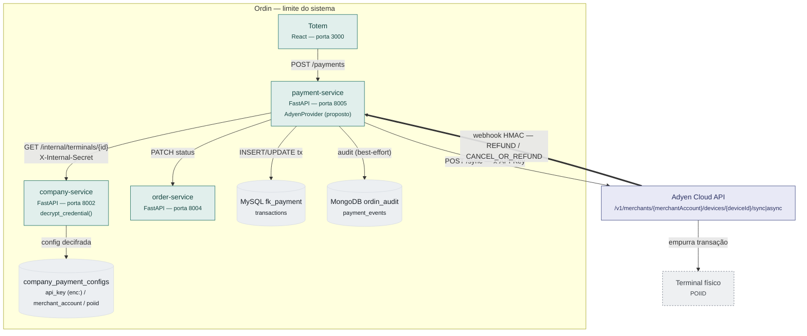
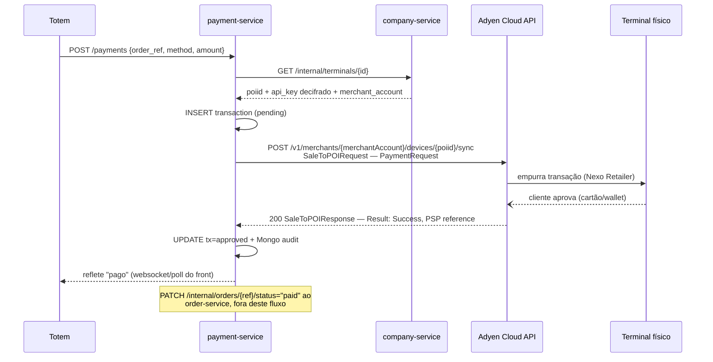

# Análise — Modelo de integração Adyen (Terminal API + Unified Commerce)

> Leitura da documentação oficial `docs.adyen.com` (Terminal API, arquitetura
> Cloud, webhooks/HMAC, Unified Commerce refunds), cruzada com o modelo já
> implementado no `payment-service` (`IPaymentProvider`, `PayGoProvider`,
> `MPProvider`, `company_payment_configs`). Nenhuma linha de código foi
> escrita — isto é material de exploração, não story `Ready`.
>
> **Contexto que muda o peso desta análise:** o usuário já implementou Adyen
> em lojas físicas na MadeiraMadeira como gerente de engenharia — várias
> pendências abaixo podem ter resposta direta dele, sem precisar esperar
> suporte Adyen. Marcado item a item na checklist.

**Decisão registrada (2026-09-05): Adyen é candidata forte** — suporte
global, e dois pontos já resolvidos na leitura da doc que travaram tanto o
PayGo quanto a Stone: **assinatura de webhook (HMAC-SHA256, documentada e com
validador oficial em Python)** e **reembolso 100% via backend, sem depender
do terminal físico**. Ver seção 5 e 6.

## Checklist — perguntas para confirmar (suporte Adyen ou experiência do usuário)

### 🚨 Bloqueantes — sem resposta, não dá pra escrever o handler com segurança

- [ ] **`terminal-api-*.adyen.com` vs `device-api-*.adyen.com`.** A doc
      pública mistura as duas gerações de host — uma resposta de sync ainda
      mostrou `terminal-api-test.adyen.com/sync`, mas a página de arquitetura
      Cloud já usa `device-api-*.adyen.com/v1/merchants/{merchantAccount}/devices/{deviceId}/sync`,
      **e avisa que só a biblioteca Java tem suporte completo pra Device
      API** (seção 3). Qual é a recomendada pra uma integração nova em 2026?
      *(Candidato a resposta direta do usuário, pela experiência na
      MadeiraMadeira.)*
- [ ] **Timeout de 150s do modo síncrono.** Isso precisa ser compatível com
      o timeout HTTP do payment-service e do gateway (Nginx local / Kong em
      produção) — qual configuração usaram na MadeiraMadeira? Modo síncrono
      segura a conexão aberta o tempo todo do pagamento (seção 3).

### ⚠️ Importantes — não travam o design, mas mudam decisões de arquitetura

- [ ] **Modo Async precisa WebSocket ativado via suporte.** Se formos usar
      Sync (recomendação inicial, seção 3), isso não bloqueia — mas vale
      perguntar se a MadeiraMadeira usava Sync ou Async e por quê.
- [ ] **Adyen como adquirente própria no Brasil** (não só gateway) — desde
      quando isso mudou o processo de cadastro/KYC de cada empresa-cliente?
      Cada empresa precisa de merchant account própria homologada, como já
      fazemos hoje pra `company_payment_configs`?
- [ ] **Host/região de live endpoint pro Brasil.** Não é pendência de doc
      pública — é dado específico da conta, visível em Customer Area >
      Developers > API URLs assim que existir conta merchant. Só registrar
      que isso é passo de cadastro, não escolha nossa.
- [ ] **Processo de provisionamento do POIID** (terminal ID) pra cada
      terminal físico vinculado a uma empresa/loja — como isso é feito no
      onboarding de um cliente novo (seção 4)?
- [ ] **Certificação PCI PTS 5 até 30/abr/2026.** Isso afeta a escolha de
      modelo de terminal pro piloto — checar com o representante comercial
      qual modelo está fora dessa janela de descontinuação.

### 💡 Menores — confirmar, mas não bloqueiam o desenho

- [ ] **Split / Adyen for Platforms** — não investigado a fundo nesta
      sessão (seção 7). Só relevante se decidirmos cobrar taxa de uso via
      split em vez de fatura.
- [ ] **Janela/prazo do reembolso via `/payments/{pspReference}/refunds`**
      — não confirmado limite de dias após a captura (seção 6).

Cada item aponta pra seção com o contexto completo.

## 0. O que é a Adyen Terminal API, em uma frase

Plataforma de **Unified Commerce**: o mesmo `pspReference` e a mesma API de
pagamentos cobrem transação física (POS, via protocolo **Nexo Retailer**
sobre a **Terminal API**) e online — diferente do PayGo e da Stone, onde
"pagamento no terminal" e "API de pagamento" são mundos mais separados. A
Adyen também atua como **adquirente própria no Brasil** (não só gateway
repassando pra outra adquirente).

## 1. Diagrama de contexto (C4 nível 1)

```mermaid
flowchart LR
    operador(["👤 Operador<br/><small>totem / caixa</small>"])
    ordin["Ordin<br/><small>FoodKiosk — autoatendimento multi-tenant</small>"]
    adyen["Adyen Cloud API<br/><small>Terminal/Device API — Nexo Retailer</small>"]
    terminal["Terminal físico<br/><small>POIID — device-serialnumber</small>"]
    bandeira["Bandeira<br/><small>Visa, Mastercard... — Adyen é a própria adquirente</small>"]

    operador -- usa --> ordin
    ordin -- "POST /sync ou /async<br/>x-API-Key" --> adyen
    adyen -- "empurra transação" --> terminal
    terminal <-- "captura / autoriza" --> bandeira
    adyen == "webhook HMAC-SHA256<br/>REFUND, CANCEL_OR_REFUND..." ==> ordin

    classDef internal fill:#e1efec,stroke:#1f6f68,color:#12433e;
    classDef external fill:#e8e9f6,stroke:#454f86,color:#2a3060;
    classDef hw fill:#eef0f2,stroke:#6b7280,stroke-dasharray: 3 3,color:#3a3f45;
    classDef person fill:#12433e,stroke:#12433e,color:#fff;
    class ordin internal
    class adyen external
    class terminal,bandeira hw
    class operador person
```



O Ordin nunca fala com o terminal nem com a bandeira diretamente — a Adyen é
o único ponto de integração, igual ao padrão já visto no PayGo e na Stone.
A diferença: aqui o webhook (seta grossa) já vem com **assinatura HMAC
confirmada e validador oficial** — não é hipótese, é mecanismo documentado
(seção 5).

## 2. Diagrama de contêineres (C4 nível 2)



Mesmo padrão de segredo já usado em PayGo/Stone/MP: `company_payment_configs`
guarda a API key criptografada, o company-service decifra antes de
responder — o payment-service nunca grava nem lê o valor cru.

## 3. Dois modos de comunicação Cloud — Sync vs Async

A Adyen documenta dois jeitos de falar com o terminal via nuvem — a escolha
aqui é bem diferente da do PayGo (que é sempre polling) e da Stone (que é
sempre push): a Adyen deixa **nós escolhermos**.

| | Sync (`/sync`) | Async (`/async`) |
|---|---|---|
| Como funciona | 1 request HTTP, conexão aberta até **150s**, resposta completa no mesmo response | Retorna `200` imediatamente; resultado chega depois via **event notification** (WebSocket) |
| Precisa de setup extra | Não | Sim — **WebSocket precisa ser ativado pelo suporte Adyen** na conta |
| Suporte de biblioteca oficial | — | Só **Java** tem suporte completo à Device API hoje |
| Equivalente no que já existe | Nenhum polling, nenhum webhook — mais parecido com "esperar a resposta" | Parecido com o modelo Stone (push), mas com um passo de ativação a mais |
| Fallback em timeout | "Transaction status request" pro mesmo endpoint `/sync` | idem |

**Recomendação inicial para v1: Sync.** Não depende de ativação de recurso
extra pelo suporte, não depende de biblioteca oficial (o payment-service já
fala com PayGo/Stone/MP via `httpx` puro, sem SDK — mesma coisa aqui), e o
resultado vem pronto numa única chamada, sem polling nem espera de webhook
pro fluxo principal. O custo é manter uma conexão HTTP aberta por até 150s —
precisa confirmar que o timeout do client HTTP do payment-service (e do
gateway na frente, Kong em produção) comporta isso.



Diferente do PayGo (que faz *N* chamadas de `GetById` até 90s) e da Stone
(que responde rápido mas só sabe o resultado no webhook, minutos depois): no
modo Sync, **uma chamada só** já traz o resultado — a conexão HTTP fica
aberta durante a transação, mas não há loop nem espera assíncrona pro fluxo
principal.

## 4. Credenciais — o que é o quê

| Campo | Nome Adyen | Para que serve | Onde viveria no Ordin |
|---|---|---|---|
| `x-API-Key` | API key com role "Cloud Device API" (ou "Terminal API") | Autentica toda chamada — vai no header `x-API-Key` | `company_payment_configs.api_key` (criptografado `enc:`), igual ao padrão PayGo/Stone/MP |
| `merchantAccount` | Conta do lojista na Adyen | Vai na própria URL do endpoint (`/merchants/{merchantAccount}/...`) | Novo campo em `company_payment_configs` ou `terminals` |
| `POIID` (Terminal ID) | `[modelo]-[nº série]`, ex: `P400-123456789` | Identifica o terminal físico — vai no `MessageHeader` de toda requisição e na própria URL (`/devices/{deviceId}/...`) | `terminals.<novo campo>`, análogo a `terminals.paygo_terminal_id` |
| HMAC key | Chave gerada no Customer Area, por webhook configurado | Assina cada notificação — usada só pra **verificar**, não pra autenticar chamada de saída | Novo campo em `company_payment_configs`, ex: `webhook_secret` (mesmo padrão já usado pro Mercado Pago) |

## 5. Webhook — assinatura HMAC confirmada (resolve o que travou PayGo e Stone)

Diferente do PayGo (webhook proposto, nunca implementado) e da Stone (schema
confirmado, mas **sem nenhuma assinatura documentada** em 9 páginas
checadas), a Adyen documenta o mecanismo completo, com validadores oficiais
prontos — inclusive em **Python**.

### Onde vem a assinatura

```json
{
  "live": "false",
  "notificationItems": [
    {
      "NotificationRequestItem": {
        "additionalData": { "hmacSignature": "..." },
        "pspReference": "...",
        "eventCode": "AUTHORISATION",
        "success": "true"
      }
    }
  ]
}
```

### Como validar

1. Concatenar, nesta ordem, separados por `:` (campo vazio vira string
   vazia): `pspReference : originalReference : merchantAccountCode :
   merchantReference : value : currency : eventCode : success`
2. Calcular **HMAC-SHA256** usando a chave HMAC (gerada em Customer Area >
   Developers > Webhooks > editar webhook > Security).
3. Codificar o resultado em Base64.
4. Comparar com `additionalData.hmacSignature` — só aceitar o payload se
   baterem.

A chave é **por webhook configurado**, e precisa ser regenerada ao migrar
de teste pra produção (não é a mesma chave dos dois ambientes).

**Isso resolve, em definitivo, o maior bloqueio que sobrou tanto do PayGo
(webhook nunca implementado) quanto da Stone (assinatura nunca confirmada,
apesar de busca exaustiva).** O handler `POST /payments/webhook/adyen`
pode recusar payload forjado desde o dia 1, sem precisar de uma chamada de
confirmação extra (o padrão "nunca confiar no status sem confirmar" que
ficou registrado como mitigação pra Stone não seria necessário aqui).

## 6. Reembolso — 100% via backend, sem terminal físico (o melhor dos três)

Comparado ao PayGo (manual, sem API) e à Stone (API existe, mas numa página
obscura de outra trilha da doc), a Adyen tem uma página **dedicada a esse
exato cenário**: `unified-commerce/referenced-refunds`.

| | Terminal API `ReversalRequest` | Payments API `refunds` |
|---|---|---|
| Onde roda | No terminal físico (POS) | Server-to-server, backend puro |
| Precisa do terminal presente | Sim | **Não** |
| Uso ideal | Devolução no próprio ponto de venda | Integrações backend, omnichannel centralizado — **é o nosso caso** |
| Endpoint | `POST` via Terminal API, `ReversalRequest` | `POST /payments/{paymentPspReference}/refunds` |
| Webhook de confirmação | `CANCEL_OR_REFUND` | `REFUND` |
| Processamento | Sempre assíncrono | Assíncrono — resposta imediata só confirma recebimento, resultado real vem pelo webhook (seção 5) |

```
POST /payments/{paymentPspReference}/refunds
{
  "merchantAccount": "YOUR_MERCHANT_ACCOUNT",
  "amount": { "value": 5000, "currency": "BRL" },
  "reference": "refund-order-123",
  "merchantRefundReason": "RETURN"
}
```

Funciona **independente de o pagamento ter sido originado no POS ou
online** — o `pspReference` é unificado entre os dois canais, exatamente o
princípio de Unified Commerce da Adyen. Isso cumpre o contrato de
`refund_transaction()` (`IPaymentProvider`, ORD-147/148/149) de forma mais
direta que qualquer um dos outros dois providers já analisados.

## 7. Split / Adyen for Platforms — não investigado a fundo

A Adyen tem um produto de marketplace/split (`Adyen for Platforms`),
análogo ao split da Stone (seção correspondente no doc Stone) e ao
Gate2all do PayGo. Não aprofundado nesta sessão porque não é bloqueio pro
caso de uso principal (pagamento simples no totem) — candidato a
investigação futura só se decidirmos cobrar taxa de uso via split.

## 8. Pontos a confirmar antes de virar story

Ver checklist consolidada no topo do documento — os itens abaixo têm o
contexto completo de onde vieram.

### 🚨 `terminal-api-*` vs `device-api-*` — doc pública mistura as duas gerações

A página de arquitetura Cloud descreve o endpoint mais novo
(`device-api-*.adyen.com/v1/merchants/{merchantAccount}/devices/{deviceId}/sync`),
mas a página de "fazer um pagamento" ainda mostra o host mais antigo
(`terminal-api-test.adyen.com/sync`). A doc da arquitetura Cloud é explícita:
**só a biblioteca Java tem suporte completo à Device API** — as demais
linguagens (.NET, Node, Go, PHP, Ruby) "terão suporte em breve". Como o
payment-service já fala com todos os outros providers via `httpx` puro, sem
depender de SDK oficial, isso não é bloqueio técnico — mas precisa
confirmar qual host é o correto/atual pra uma integração nova, porque a doc
pública não deixa isso claro sozinha.

### ⚠️ Timeout de 150s do modo Sync

Precisa bater com o timeout HTTP configurado no client do payment-service e
no gateway (Nginx local, Kong em produção) — do jeito que está hoje (PayGo
usa timeout de 90s pro polling completo), 150s é mais longo que qualquer
operação síncrona já existente no Ordin. Vale simular antes de assumir que
"vai funcionar sem configuração extra".

### ⚠️ Modo Async exige ativação de WebSocket via suporte

Se a decisão for usar Sync (seção 3), isso não bloqueia a v1 — mas é uma
dependência de suporte (não self-service) caso decidamos migrar pra Async
depois.

### ⚠️ Adyen como adquirente própria no Brasil

Segundo material de imprensa da própria Adyen, ela é adquirente própria no
Brasil (gateway + antifraude + adquirência num só), diferente do modelo
"gateway que repassa pra adquirente terceira" que PayGo e Stone usam por
baixo. Não confirmado: se isso muda o processo de KYC/cadastro de cada
empresa-cliente do Ordin (merchant account própria por empresa, igual já
fazemos hoje com `company_payment_configs`, ou processo diferente).

### 💡 Certificação PCI PTS 5 até 30 de abril de 2026

Dispositivos PCI PTS 5 só ficam disponíveis pra pedidos existentes até essa
data — relevante pra escolher modelo de terminal pro piloto, pra não comprar
equipamento que sai de linha logo em seguida.

### 💡 Host/região do live endpoint pro Brasil

Não é pendência de documentação pública — é informação específica da conta,
visível em Customer Area > Developers > API URLs assim que existir uma
conta merchant provisionada. Só registrar que esse dado só aparece depois do
cadastro, não é algo pra decidir agora.

## 9. Fontes

Leitura automatizada (resumo por IA) das páginas abaixo, em 2026-09-05 —
tratar como pistas a confirmar na íntegra (e, neste caso específico, também
com a experiência prática do usuário na MadeiraMadeira) antes de mexer em
produção:

- `point-of-sale/design-your-integration/terminal-api`,
  `point-of-sale/design-your-integration/choose-your-architecture/cloud`,
  `point-of-sale/design-your-integration/choose-your-architecture/local`,
  `point-of-sale/design-your-integration/notifications`,
  `point-of-sale/design-your-integration/notifications/standard-notifications`,
  `point-of-sale/design-your-integration/terminal-api/get-the-terminal-id`,
  `point-of-sale/basic-tapi-integration/make-a-payment`,
  `point-of-sale/basic-tapi-integration/refund-payment`
- `development-resources/webhooks/secure-webhooks/verify-hmac-signatures`,
  `online-payments/refund`, `unified-commerce/referenced-refunds`
- Página institucional:
  `adyen.com/pt_BR/centro-de-conhecimento/integracao-de-meios-de-pagamento-como-fazer-beneficios`
- Busca web complementar: anúncio de imprensa da Adyen sobre adquirência
  própria no Brasil; menção a certificação PCI PTS 5 (data-limite abr/2026).

Não lidas em detalhe nesta sessão (candidatas a aprofundar antes de virar
story): `point-of-sale/network-and-connectivity`,
`point-of-sale/basic-tapi-integration/cancel-a-transaction`,
`point-of-sale/basic-tapi-integration/verify-transaction-status`,
`point-of-sale/error-scenarios`, `point-of-sale/testing-pos-payments`,
`point-of-sale/get-started`, produto **Adyen for Platforms** (split/marketplace).
