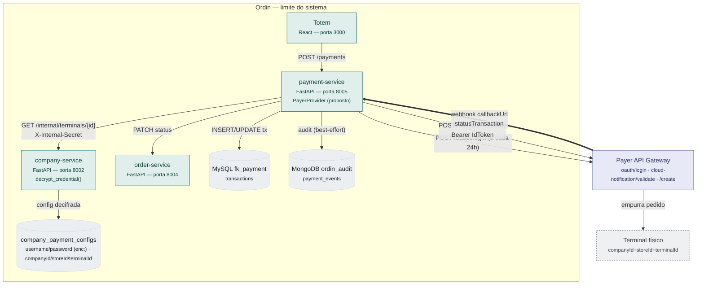
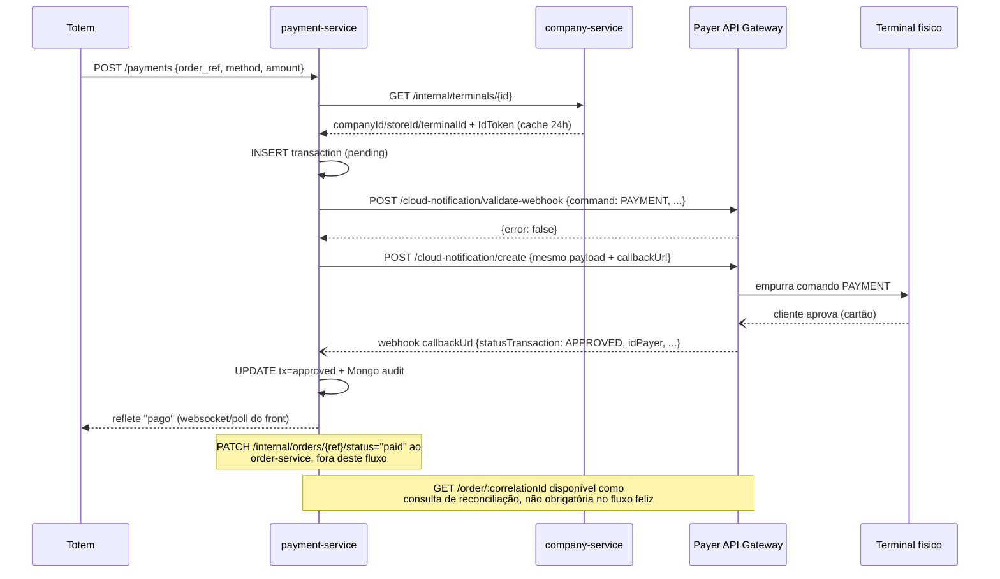
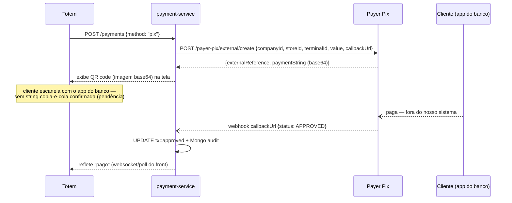

# Análise — Modelo de integração Payer (API Gateway + Pix)

> Leitura da documentação oficial `docs.payer.com.br` (via índice `llms.txt`),
> cruzada com o modelo já implementado no `payment-service`
> (`IPaymentProvider`, `PayGoProvider`, `MPProvider`, `company_payment_configs`).
> Nenhuma linha de código foi escrita — isto é material de exploração, não
> story `Ready`. Diferente dos docs de Stone e Adyen, **ainda não há decisão
> registrada de seguir com a Payer** — este documento existe pra responder
> "dá pra chegar numa análise no mesmo nível das outras três?", não pra
> declarar a Payer candidata. Ver `docs/WORKFLOW.md` — nenhuma linha de
> produção antes de `Ready`, e aqui nem o Explorer começou.

## Checklist — perguntas para o suporte/comercial Payer

### 🚨 Bloqueantes — sem resposta, não dá pra escrever o handler com segurança

- [ ] **Assinatura do webhook.** Nenhuma das quatro páginas técnicas lidas
      (API Gateway, Autenticação, Pix, E-commerce) menciona HMAC, header
      secreto ou qualquer mecanismo de validação da notificação recebida em
      `callbackUrl`. Busca externa complementar também não achou nada — ver
      seção 6. Mesma situação da Stone (que também não documentou nada
      depois de 9 páginas lidas), mas aqui a superfície documentada é bem
      menor, então "não documentado" pesa menos como evidência de ausência
      real — vale perguntar direto antes de assumir que não existe.
- [ ] **Existe sandbox de verdade, ou só o simulador Windows do Checkout
      Desktop?** A doc menciona um "modo simulação" do Checkout Desktop
      (app Windows) pra testar sem pinpad físico — mas todos os endpoints
      de transação lidos (Gateway, Pix) apontam pra hosts `prod-stage`.
      Só o endpoint de login usa `dev-stage`. Isso é um ambiente de
      homologação real (dados de teste, sem custo, sem tocar terminal de
      verdade) ou só um detalhe de nome do host de autenticação? Ver seção 6.
- [ ] **Pix na tela exige `terminalId` vinculado?** O payload de criação de
      cobrança Pix (seção 4) inclui `companyId`/`storeId`/`terminalId`
      igual ao payload de cartão — diferente de Stone/PayGo (Gate2all)/Adyen,
      onde o produto de "Pix sem terminal" não pede nenhum identificador de
      hardware. Se for obrigatório mesmo, uma empresa-cliente que só quisesse
      aceitar Pix (sem comprar/alugar um terminal físico Payer) não
      conseguiria — isso muda completamente se a Payer serve como
      alternativa ao Mercado Pago pro nosso fluxo de Pix-na-tela hoje
      implementado.

### ⚠️ Importantes — não travam o design, mas mudam decisões de arquitetura

- [ ] **Renovação do `IdToken`.** Expira em 24h (`ExpiresIn: 86400`) e a
      resposta de login também traz um `RefreshToken`, mas nenhuma página
      lida documenta o endpoint/fluxo de refresh. Sem isso, a única opção
      confirmada é logar de novo com usuário/senha a cada 24h — diferente do
      padrão hoje (PayGo/Stone usam uma chave estática, sem sessão que
      expira). Precisa de um mecanismo de renovação automática no
      `payment-service`, e não está claro se é "chamar login de novo" ou
      "trocar o `RefreshToken` por um `IdToken` novo".
- [ ] **Onboarding como parceiro técnico.** Nenhuma página documenta o
      processo real de credenciamento — quais dados são pedidos, quanto
      tempo leva, se existe um cadastro de programa de parceiros formal
      (como o Stone Partner Program) ou é direto com o time comercial.
      `username`/`password` são descritos como "criados durante o processo
      de onboarding Payer", sem detalhar o processo em si.
- [ ] **Formato do QR Pix — só imagem base64?** A resposta documentada traz
      `paymentString` como imagem base64; não ficou confirmado se também
      existe a string EMV "copia e cola" (como Stone/PayGo retornam os
      dois). Sem o copia-e-cola, o totem só consegue mostrar a imagem do QR,
      sem opção de copiar o código — regressão de UX comparado ao fluxo
      Mercado Pago já implementado.
- [ ] **Prazo de expiração do QR Pix** não veio documentado (Stone documenta
      90 dias de estorno + expiração configurável; PayGo/Gate2all usa 7 dias
      por padrão). Sem isso não dá pra decidir timeout de exibição no totem.

### 💡 Menores — confirmar, mas não bloqueiam o desenho

- [ ] **Split de pagamento no fluxo de terminal físico.** O objeto `split`
      só apareceu documentado na API de **E-commerce** (cartão digitado
      online) — não confirmado se o mesmo mecanismo existe no fluxo de
      terminal físico (API Gateway), que é o caso de uso real do totem.
- [ ] **Lista de terminais/Smart POS compatíveis.** A doc do Gateway
      menciona uma página separada ("Smart POS - Lista de Compatibilidade")
      que não veio no índice `llms.txt` nem apareceu em busca — não
      encontrada nesta sessão.

### ✅ Resolvido — não precisa perguntar ao suporte

- [x] **Qual dos quatro produtos de integração serve ao Ordin.** A Payer
      oferece quatro caminhos (seção 0) — só um serve o nosso modelo
      (totem próprio, backend próprio, terminal físico separado): a
      **API Gateway**. API Localhost é pra app embarcado no próprio
      terminal ou rodando na mesma rede local dele (não é o nosso caso —
      o `payment-service` já fala com PayGo/Stone/Adyen via nuvem, sem
      nenhum agente local); o Checkout SDK é pra quem usa hardware
      embarcado (Raspberry/totem) da própria Payer, o que não é o nosso
      hardware; a API de E-commerce é pra checkout online sem terminal
      físico, fora do escopo do totem.
- [x] **Cancelamento de cartão exige o cartão físico de novo.** Confirmado
      na doc: "não é possível estornar pagamentos sem o cartão que efetuou
      o pagamento originalmente" — mesma limitação inicial que PayGo tinha
      antes de qualquer API de estorno backend. Só o Pix tem endpoint de
      cancelamento via API sem depender de hardware presente (seção 4).

Cada item aponta pra seção com o contexto completo.

## 0. O que é a Payer, em uma frase

Um **agregador multi-adquirente** ("Rota de Menor Custo" — escolhe a
adquirente mais barata por transação) que também vende hardware e software
de PDV próprios (Checkout Desktop pra Windows, Checkout POS pra Smart POS
Android) — em espírito, mais parecido com o PayGo (o `payment-service` fala
com a plataforma da Payer, nunca direto com o terminal ou a adquirente) do
que com a Stone/Adyen (que são elas mesmas adquirente). A particularidade
que mais chama atenção na leitura: mesmo o produto de "Pix na tela" pede um
`terminalId` vinculado (seção 4) — sugerindo que o modelo da Payer pressupõe
hardware físico presente até pra fluxos que, em outros providers já
analisados, dispensam completamente o terminal.

## 1. Diagrama de contexto (C4 nível 1)

Modelo *push*: o `payment-service` cria a ordem de pagamento na nuvem da
Payer, o terminal físico entra sozinho na tela (igual ao "Pagamento Direto"
da Stone e ao "Modo Ativo" do PayGo), e o resultado chega via webhook —
sem polling no fluxo principal.

```mermaid
flowchart LR
    operador(["👤 Operador<br/><small>totem / caixa</small>"])
    ordin["Ordin<br/><small>FoodKiosk — autoatendimento multi-tenant</small>"]
    payer["Payer API Gateway<br/><small>cloud-notification/create · validate</small>"]
    terminal["Terminal físico<br/><small>Checkout POS/Desktop — Smart POS</small>"]
    adquirente["Adquirente<br/><small>Rota de Menor Custo — escolhida pela Payer</small>"]

    operador -- usa --> ordin
    ordin -- "valida + cria ordem<br/>POST /create · Bearer IdToken" --> payer
    payer -- "empurra pedido<br/>PAYMENT" --> terminal
    terminal <-- "captura / autoriza" --> adquirente
    payer == "webhook callbackUrl<br/>statusTransaction — sem assinatura documentada" ==> ordin

    classDef internal fill:#e1efec,stroke:#1f6f68,color:#12433e;
    classDef external fill:#e8e9f6,stroke:#454f86,color:#2a3060;
    classDef hw fill:#eef0f2,stroke:#6b7280,stroke-dasharray: 3 3,color:#3a3f45;
    classDef person fill:#12433e,stroke:#12433e,color:#fff;
    class ordin internal
    class payer external
    class terminal,adquirente hw
    class operador person
```



O Ordin nunca fala com o terminal nem com a adquirente diretamente — só com
a API Gateway da Payer. A seta grossa é o webhook: mecanismo padrão
documentado (não uma alternativa a polling, como no PayGo hoje), mas sem
nenhuma confirmação de assinatura — mesmo ponto em aberto que travou a Stone.

## 2. Diagrama de contêineres (C4 nível 2)

Mesmo padrão de segredo dos outros três: credencial criptografada em
`company_payment_configs`, decifrada pelo company-service. Diferença real
aqui: o que se guarda não é uma chave estática, é um par usuário/senha que
gera um token com expiração de 24h — precisa de um passo extra de login/
renovação que os outros providers não exigem.



Nada disto está implementado — é o desenho equivalente ao que já existe pra
PayGo/Mercado Pago, trocando o provider e somando o passo de login/token.

## 3. Fluxo de pagamento com cartão — API Gateway

Diferente do PayGo (uma chamada de venda + polling) e mais parecido com a
Stone (uma chamada, resultado via webhook), a Payer intercala um passo de
**validação** antes da execução — a doc é explícita que o `/validate`
confere sintaxe do comando e se o terminal está conectado, *antes* de
enviar de fato ao terminal.



### Cancelamento — só com o cartão físico de novo

Comando `CANCELLMENT` referenciando o `idPayer` da transação original — mas
a doc é explícita que **exige o mesmo cartão físico presente novamente**.
Não há, na doc lida, um endpoint de estorno backend puro pra cartão (como a
Adyen tem via `refunds` e a Stone via `DELETE /charges/{id}`) — hoje isso
deixaria a Payer no mesmo ponto em que o PayGo estava antes de qualquer
API de estorno: reembolso de cartão só é operacionalmente viável com o
cliente/cartão de volta ao balcão, o que não cumpre bem o contrato de
`refund_transaction()` (`IPaymentProvider`, ORD-147/148/149) para casos como
"pagamento aprovado, mas item saiu de estoque depois" (mesmo cenário que a
D2/ORD-200 trata pra PayGo/Mercado Pago).

## 4. Pix na tela — mesmo endpoint, mas exige terminal

Diferente de Stone (Pix via Gateway/Pagar.me, sem `poi_payment_settings`),
PayGo (Gate2all, sem `terminalId`) e Adyen (Payments API, sem POIID), o
payload de criação de Pix da Payer **pede os mesmos três identificadores de
hardware** do fluxo de cartão:

```json
POST https://ms7bi3gsxk.execute-api.us-east-1.amazonaws.com/prod-stage/payer-pix/external/create
{
  "accountId": "xxxxxx",
  "companyId": "xxxxxx",
  "storeId": "xxxx",
  "terminalId": "xx",
  "value": 1.00,
  "document": "",
  "callbackUrl": "https://meu.callback.externo/webhook"
}
```



### Estorno de Pix — existe, e não depende de hardware

```
POST /payer-pix/external/cancellation/{externalReference}
```

Diferente do cartão (seção 3), o Pix **tem** endpoint de cancelamento
backend puro — mais parecido com o padrão que Stone/Adyen já cumprem pro
contrato `refund_transaction()`. Só cobre Pix, não cartão.

### Status observados

`PENDING` (aguardando pagamento) → `APPROVED` (confirmado) → `EXPIRED`
(estourou o prazo, não documentado qual é). Catálogo mais enxuto que o da
Stone (que documenta status detalhado de cartão/autorização no mesmo
payload) — não ficou claro se existe algum status de erro/falha distinto de
`EXPIRED`.

## 5. Credenciais — o que é o quê

| Campo | Nome Payer | Para que serve | Onde viveria no Ordin |
|---|---|---|---|
| `username` / `password` | Credenciais de onboarding | Trocadas por um token via `POST /oauth/login` — não são usadas diretamente nas chamadas de transação | `company_payment_configs.api_key`/`api_secret` (criptografado `enc:`), mesmo padrão dos outros providers |
| `IdToken` | Token de sessão (JWT, expira em 24h) | É o único dos três tokens retornados (`AccessToken`, `IdToken`, `RefreshToken`) realmente aceito nas chamadas — vai em `Authorization: Bearer` | Não persistido — cache em memória/Redis do payment-service, renovado via login de novo a cada ~24h (mecanismo de refresh não confirmado, ver checklist) |
| `RefreshToken` | Token de renovação | Retornado no login, mas nenhuma página documenta como usá-lo | Não mapeado — pendência |
| `companyId` / `storeId` / `terminalId` | Identificação hierárquica do estabelecimento e terminal | Vai em todo payload de criação de ordem (cartão e Pix) | `terminals.<novos campos>`, análogo a `terminals.paygo_terminal_id`, mas são três campos em vez de um |
| `callbackUrl` | URL do nosso webhook | Enviada **por chamada** (não registrada uma vez por conta, diferente do `Callback/Insert` do PayGo) | Constante do payment-service, passada em toda criação de ordem |

## 6. Pontos a confirmar antes de virar Explorer

### 🚨 Webhook sem assinatura documentada — busca cobriu 4 páginas + web

Lidas integralmente: `docs/integrations/api-gateway.html`,
`docs/integrations/authentication.html`, `docs/integrations/pix-payer.html`,
`docs/integrations/ecommerce.html`. Nenhuma menciona HMAC, header de
assinatura, secret compartilhado ou IP de origem fixo. Busca web
complementar (`"docs.payer.com.br" webhook assinatura HMAC secret
validação`) não trouxe nenhum resultado do domínio da Payer.

**Diferença importante em relação à Stone:** lá a superfície documentada
era grande (9+ páginas, dois produtos) e mesmo assim não achamos nada —
evidência mais forte de ausência real. Aqui a doc pública inteira é só 6
páginas — "não documentado" pesa menos como prova de que não existe.
Pergunta direta ao suporte é ainda mais necessária aqui do que foi pra
Stone antes de confiar cegamente no `statusTransaction` do payload.
Mitigação arquitetural, independente da resposta: usar o `GET
/cloud-notification/order/{correlationId}` (que já existe e é mencionado
como "reporta falhas de comunicação não logadas no banco") como consulta de
confirmação antes de marcar a transação como aprovada — mesmo padrão de
"push-triggered single-fetch" já proposto pro PayGo (seção 6 do doc PayGo)
e como mitigação pra Stone.

### 🚨 Sandbox real ou só simulador local?

Todo endpoint de transação lido (`/cloud-notification/validate-webhook`,
`/cloud-notification/create`, `/payer-pix/external/create`) usa o host
`prod-stage`. Só `/oauth/login` usa `dev-stage` — mas isso pode ser só uma
particularidade de nome do serviço de autenticação, não necessariamente um
ambiente de teste isolado dos dados de produção. O único mecanismo de teste
sem hardware real confirmado na doc é o **modo simulação do Checkout
Desktop** — um app Windows, específico do fluxo Desktop, não uma forma de
testar a API Gateway isoladamente. Se não existir sandbox de API de
verdade, o processo de homologação/QA fica no mesmo caso da Stone: testes
com valores simbólicos direto em produção.

### 🚨 Pix exige terminal físico vinculado — não confirmado o porquê

Todos os providers já analisados (Stone/Pagar.me Gateway, PayGo/Gate2all,
Adyen Payments API) têm um produto de "Pix na tela" que dispensa qualquer
identificador de hardware — é justamente o que permite ao Mercado Pago
(já implementado) funcionar sem depender de terminal nenhum. Se a exigência
de `terminalId` no payload de Pix da Payer for de fato obrigatória (não só
um campo aceito mas ignorável), isso significa que uma empresa-cliente
precisaria ter um terminal Payer contratado só pra habilitar Pix — mudaria
fundamentalmente se a Payer serve como alternativa ao Mercado Pago no nosso
fluxo de Pix-na-tela hoje existente, ou só como alternativa ao PayGo no
fluxo de cartão.

### ⚠️ Renovação do `IdToken` — mecanismo de refresh não documentado

24h é uma janela curta comparada às chaves estáticas do PayGo/Stone/Adyen.
Sem confirmar o fluxo de refresh, a implementação mais simples (login de
novo com usuário/senha antes de cada expiração) funciona, mas expõe a
senha em mais chamadas do que o necessário — vale confirmar se existe um
jeito de trocar só o `RefreshToken` por um `IdToken` novo, sem repetir a
senha.

### ⚠️ Onboarding como parceiro — processo real não documentado

Diferente da Stone (que tem um "Partner Program" com etapas descritas em
`docs/processo-de-integração`) e da Adyen (Customer Area com API URLs
específicas por conta), a Payer não documenta publicamente como um parceiro
técnico se cadastra — só menciona que as credenciais "são criadas durante o
onboarding", sem descrever o processo em si. Provavelmente é um fluxo
comercial direto (o footer do site aponta pra "Seja Parceiro" com contato
comercial, não um formulário de self-service).

### 💡 Split de pagamento — só confirmado no produto errado

O objeto `split` está documentado na API de **E-commerce** (cartão
digitado online, fora do escopo do totem) — não confirmado se o mesmo
mecanismo existe na API Gateway (terminal físico), que é o fluxo relevante
pro Ordin.

### 💡 Formato do QR Pix e prazo de expiração

Só veio confirmado `paymentString` como imagem base64 — sem confirmação de
string EMV copia-e-cola (regressão de UX vs. Mercado Pago/Stone/PayGo, que
oferecem os dois) nem prazo de expiração do QR.

## 7. Fontes

Leitura automatizada (resumo por IA) das páginas abaixo, via índice
`https://docs.payer.com.br/llms.txt`, nesta sessão — tratar como pistas a
confirmar na íntegra, não como fato assentado, antes de qualquer decisão:

- `docs.html` (índice geral — não descreve onboarding/sandbox)
- `docs/integrations/api-gateway.html` (fluxo completo de validação +
  criação de ordem + webhook + cancelamento de cartão)
- `docs/integrations/authentication.html` (fluxo OAuth completo — login,
  formato do token, uso em `Authorization: Bearer`)
- `docs/integrations/pix-payer.html` (criação de cobrança Pix, formato do
  QR, cancelamento)
- `docs/integrations/ecommerce.html` (confirma escopo — só checkout online,
  não terminal físico; único lugar onde `split` aparece documentado)
- `docs/integrations/api-localhost.html` (confirma que não é o caminho
  certo pro Ordin — é pra app embarcado no terminal ou na rede local dele)

Não lidas em detalhe nesta sessão (candidatas a aprofundar antes de
Explorer): `docs/integrations/sdk.html` (Checkout SDK pra hardware
embarcado próprio da Payer — Raspberry/totem Android, fora do nosso
modelo de hardware), `docs/integrations/checkout-web.html` (links de
pagamento via Gateway — não é o fluxo de terminal físico), `partner/`
(Área do Parceiro — não confirmado o que essa seção contém), e a página
"Smart POS - Lista de Compatibilidade" mencionada na doc do Gateway, mas
não localizada nesta sessão.

Página institucional `payer.com.br/seja-parceiro` confirma existência de
quatro modelos de integração e reforça o contato comercial como canal de
credenciamento, mas não substitui a doc técnica acima.

Busca web complementar sem resultado do domínio da Payer:
`"docs.payer.com.br" webhook assinatura HMAC secret validação` e
`Payer docs.payer.com.br "Smart POS" compatibilidade terminal` — ambas
retornaram apenas conteúdo de terceiros (outros gateways, blogs sobre Smart
POS em geral), sem confirmar nem refutar os pontos em aberto acima.
