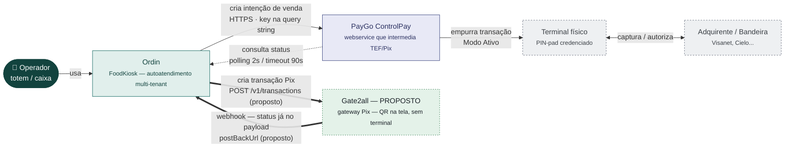
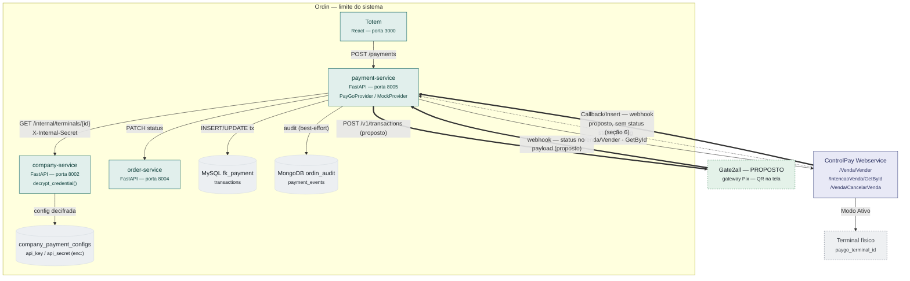
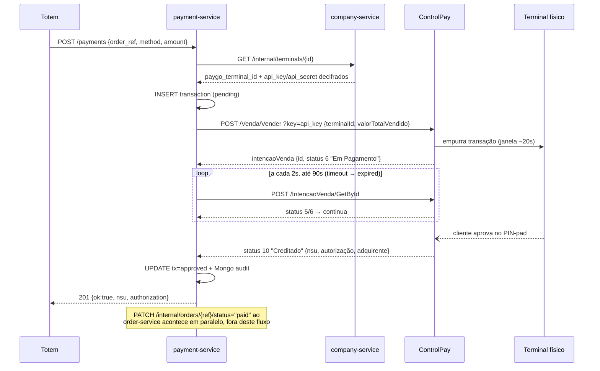
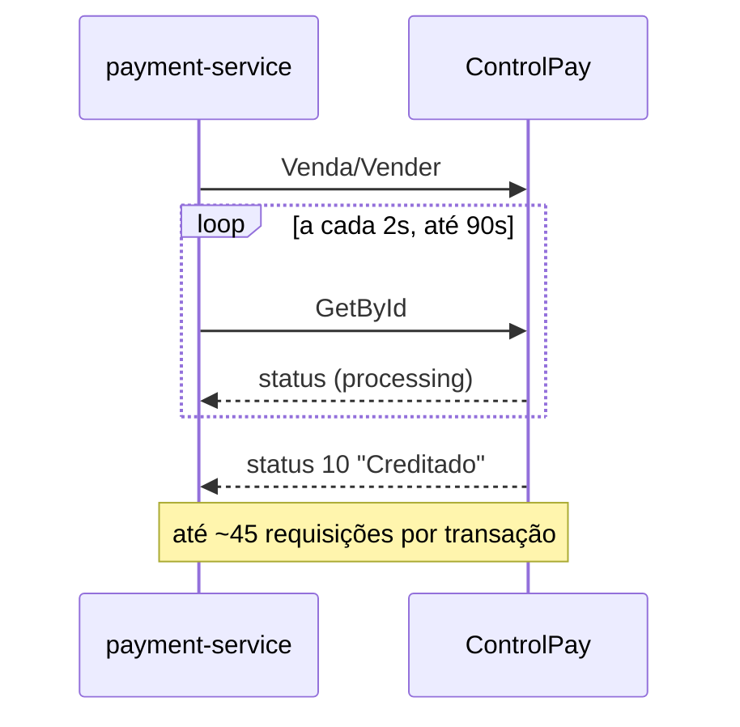
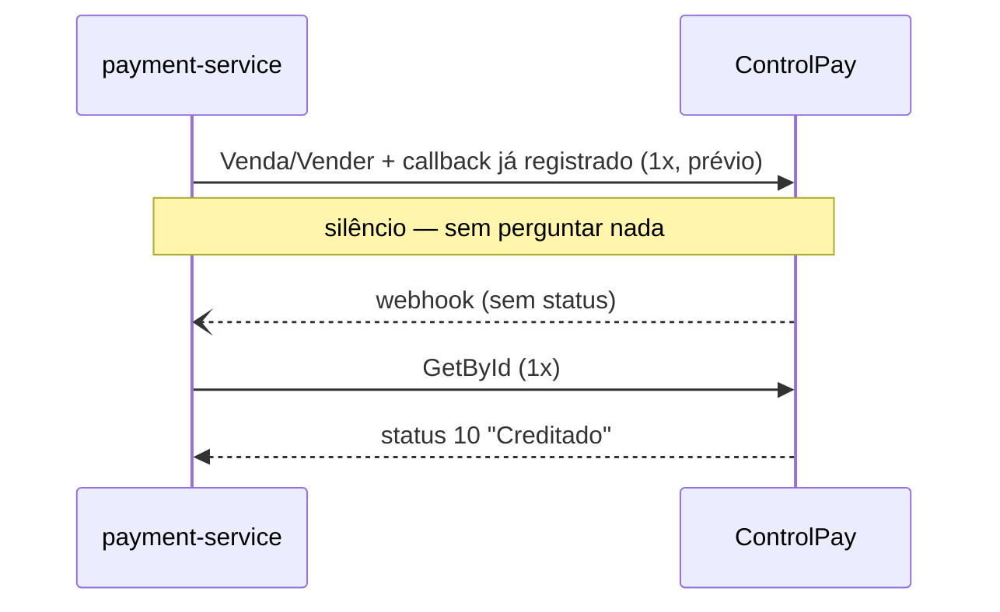
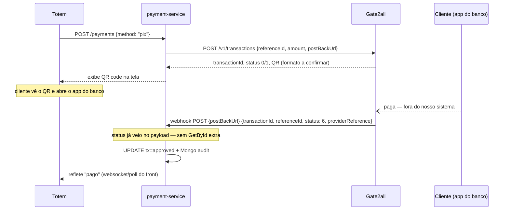

# Análise — Modelo de integração PayGo ControlPay

> Reavaliação do modelo implementado em `ORD-025` (`docs/stories/ORD-025-paygo-tef-integracao.md`,
> `services/payment/infrastructure/providers/paygo.py`), cruzado com a documentação oficial
> `paygodev.readme.io`. Objetivo: servir de referência rápida de "como isso funciona" e listar o
> que ainda precisa ser confirmado na doc oficial antes de mexer em produção.

## 1. Diagrama de contexto (C4 nível 1)

O Ordin nunca fala diretamente com o terminal físico nem com a adquirente — o ControlPay é o
único ponto de integração.



Em verde/tracejado: caminho Pix via Gate2all (seção 7) — **proposto, não implementado**. O
Ordin nunca fala com o terminal nem com a adquirente; com o Gate2all também não haveria
terminal envolvido, mas ali quem avisa é o gateway — não o Ordin que pergunta.

## 2. Diagrama de contêineres (C4 nível 2)

As credenciais (`api_key`, `api_secret`) nunca chegam em texto puro ao MySQL do payment-service —
o company-service decifra antes de responder. O payment-service não grava nem lê o valor cru,
só repassa o que recebeu.



Setas grossas (`==>`): os dois caminhos de webhook propostos — callback do ControlPay
(seção 6) e o container Gate2all para Pix na tela (seção 7). Nenhum dos dois está
implementado hoje.

## 3. Fluxo de execução — Modo Ativo (venda por cartão)

O mecanismo central: um *push* inicial seguido de *polling*. Números direto do código
(`_POLL_INTERVAL = 2.0`, `_POLL_TIMEOUT = 90.0` em `paygo.py`).



O passo do `empurra transação` é o único trecho fora da visibilidade do Ordin: depois que o
ControlPay confirma o recebimento, tudo o que acontece no PIN-pad físico só chega até nós
através do polling.

### Não é webhook — é polling ativo

É comum ler o fluxo como "PayGo chama o Ordin de volta" (webhook), mas **hoje não é isso**: o
`payment-service` é quem pergunta repetidamente (`GET /IntencaoVenda/GetById` a cada 2s), o
ControlPay nunca inicia uma chamada para nós.

Existe um endpoint `POST /payments/webhook/paygo` (`services/payment/main.py:1417`), mas é um
**placeholder desconectado**: aceita qualquer payload, grava em auditoria no Mongo e responde
`200` — não correlaciona com nenhuma transação, não tem `company_id` no path, e o
`create_transaction()` do `PayGoProvider` não registra nenhuma `callbackUrl`/`postBackUrl` na
chamada `Venda/Vender`. Compare com o Mercado Pago
(`/payments/webhook/mercadopago/{company_id}`), que é o mecanismo ativo de verdade por lá.

Ou seja: PayGo hoje é 100% *pull* (nós perguntamos); Mercado Pago é *push* (ele avisa).

## 4. Credenciais — o que é o quê

| Campo | Nome PayGo | Para que serve | Onde vive no Ordin |
|---|---|---|---|
| `api_key` | Chave de integração | Autentica toda chamada — vai na query string `?key=`. Duas variantes: **chave de sistema** (gerada por login, expira em ~1 dia) e **chave de pessoa** (gerada no portal, pode não expirar). | `company_payment_configs.api_key` (criptografado `enc:`) |
| `api_secret` | Senha técnica | Exigida em operações administrativas sensíveis — no nosso caso, só em `Venda/CancelarVenda` como `senhaTecnica`. | `company_payment_configs.api_secret` (criptografado `enc:`) |
| `terminalId` | ID lógico do terminal | Identifica o PIN-pad dentro do portal ControlPay — usado em toda transação. | `terminals.paygo_terminal_id` |

## 5. Pontos a confirmar diretamente na documentação PayGo

Vieram de uma leitura automatizada (resumo por IA) das páginas de `paygodev.readme.io` — tratar
como pistas a verificar na íntegra, não como fato assentado, antes de mudar código de produção.

### ⚠️ Tipo de chave de integração em uso

A doc distingue **chave de sistema** (expira em ~1 dia) de **chave de pessoa** (persistente,
recomendada sem expiração). O `ORD-025` não registra qual tipo foi cadastrado nas contas
sandbox/produção do piloto.

**Por quê importa:** se por engano uma chave de sistema foi usada como `api_key` permanente, o
pagamento passa a falhar sozinho depois de ~24h sem nenhuma mudança de código — sintoma difícil
de associar à causa.

### ⚠️ Janela de ~20s do ControlPay vs. nosso timeout de 90s

A doc do Modo Ativo menciona um tempo máximo de ~20s para o ControlPay empurrar a transação ao
terminal. Nosso `PayGoProvider` faz polling por até 90s no lado do cliente.

**Por quê importa:** os dois timeouts parecem cobrir coisas diferentes (20s = ControlPay acionar
o terminal; 90s = tempo total até o cliente terminar de pagar), mas vale confirmar que o
ControlPay não marca a `intencaoVenda` como expirada aos 20s enquanto nós continuamos fazendo
polling até 90s — o que geraria um "expired" nosso mesmo com status final diferente do lado
deles.

### ✅ Resolvido — Pix via terminal (`formaPagamentoId=25`) vs. API de Pix dedicada (Gate2all)

São **dois produtos diferentes** dentro da família PayGo, não um só. Ver seção 7 para o
detalhamento completo — resumo: `formaPagamentoId=25` no `Venda/Vender` aciona Pix **no
terminal físico** (cliente aproxima o celular do PIN-pad); a API de Pix descrita como
`POST /v1/transactions` é um produto à parte chamado **Gate2all**, com host, autenticação e
modelo de webhook próprios, sem `terminalId` — é esse o caminho para exibir o QR na tela do
totem, como o Mercado Pago.

### ✅ Resolvido — Autenticação por header em outra página da doc

Confirmado: é o **Gate2all** (seção 7), não uma camada adicional do ControlPay Webservice.
`authenticationApi` / `authenticationKey` como headers é o modelo de auth desse produto
específico — o `?key=` na query string continua sendo exclusivo do ControlPay.

### 💡 Oportunidade — registrar callback em vez de só fazer polling

O ControlPay tem um recurso real de callback (`gerenciamento-de-urls-de-callback`): a URL é
registrada **por conta/chave de integração** (não por chamada de venda), via API própria
(Insert/Update/Delete), e vale para todos os terminais daquele CPF/CNPJ. Ao receber a
notificação, o payload traz `intencaoVenda.id` + nossa referência — mas a doc é explícita que
**ainda é preciso** chamar `GetById` depois pra confirmar o resultado completo. Ou seja, o
callback não substitui o `GetById`, só substitui o *polling a cada 2s* por um único gatilho.

**Por quê importa:** o placeholder `/payments/webhook/paygo` já existe no código exatamente pra
isso — hoje ele só grava auditoria e não faz nada com o payload. Ligar esse fio (registrar a
callback URL na conta ControlPay + fazer o handler chamar `GetById` e atualizar a transação)
elimina os até 90s de polling ativo por transação, o que reduz carga no payment-service e latência
de confirmação. É trabalho de story nova, não um bug do que já existe.

### ✅ Confirmado — senha técnica em cancelamento

O uso de `api_secret` como `senhaTecnica` só no `Venda/CancelarVenda` bate exatamente com o que a
doc descreve para "operações administrativas sensíveis".

### ✅ Confirmado — terminal autônomo, sem PayGo Windows/Android

A doc trata **PayGo Windows** e **PayGo Android** como a "camada de execução da transação" —
obrigatória apenas quando o PIN-pad é "burro" (USB/Bluetooth) e precisa de um agente local (PC ou
tablet) fazendo ponte com a nuvem ControlPay. O `ORD-025` nunca resolveu essa dúvida —
`terminalFisicoId` está marcado como "fora do escopo".

**Confirmado com o time:** o terminal contratado para o piloto é **autônomo, com chip próprio**
(conectividade de rede independente). Isso significa que o ControlPay fala direto com o terminal
pela rede dele mesmo — **nenhum agente local é necessário**, nem no totem, nem em PC nenhum. A
arquitetura já desenhada (seções 1–3) está correta como está: `payment-service → ControlPay →
Terminal`, sem intermediário.

## 6. Webhook real do ControlPay — como funciona

Investigação aprofundada a pedido, porque polling em loop (2s / 90s) é considerado má prática
arquitetural e o time já teve uma integração PayGo anterior com webhook sem polling.

**Hoje — polling:**



**Proposto — callback:**



A mesma janela de tempo, dois modelos: hoje o payment-service pergunta em loop fixo (2s/90s)
independente de quando o cliente termina de pagar; com callback, ele só é acionado quando algo
de fato acontece — a duração real do pagamento deixa de ser um timeout fixo do nosso lado.

### Endpoints de gerenciamento de callback

```
POST   {{Url}}/Callback/Insert/?key={{Key}}   body: {"callbackTipo": 1, "urlCallback": "https://..."}
POST   {{Url}}/Callback/Update/?key={{Key}}   body: {"callbackTipo": 1, "urlCallback": "https://..."}
DELETE {{Url}}/Callback/Delete/?key={{Key}}   body: {"callbackTipo": 1}
```

`callbackTipo: 1` = notificação de venda. (Existe também um tipo de callback de impressão, com
schema diferente — inclui status; fora do nosso escopo.)

**Escopo do registro:** por **chave de integração**, ou seja, por `company_payment_config`
(empresa + ambiente) no nosso modelo — não por terminal, não por venda individual. Registrar uma
vez cobre todos os terminais daquele CPF/CNPJ.

### Payload da notificação

Vem como **query string**, não como JSON no body:

| Campo | Conteúdo |
|---|---|
| `cpfCnpj` | CPF/CNPJ da conta |
| `intencaoVendaId` | ID da venda no ControlPay |
| `intencaoVendaReferencia` | nossa referência — bate com `order_ref` |
| `pedidoId` / `pedidoReferencia` | vazios quando não há `Pedido` associado |

**Não vem status.** A doc é explícita: depois de receber a notificação, "o sistema deverá
consultar a transação no ControlPay através das APIs" para saber o resultado.

### O que isso muda de verdade

Não é "zero chamadas depois do webhook" — é **push-triggered single-fetch** em vez de
**poll-loop**: hoje fazemos até ~45 chamadas `GetById` por transação (a cada 2s até 90s); com
callback, fazemos **uma** `GetById` só quando o ControlPay nos avisa que a venda "foi
finalizada". Resolve o incômodo real do polling em loop, sem virar um modelo 100%
event-driven — ainda existe uma chamada de confirmação depois do evento.

**Em aberto, não confirmado pela doc lida:** quais estados finais disparam o callback — só
aprovado, ou também recusado/cancelado/expirado? Isso decide se ainda precisamos de um timeout
de segurança nosso (ex: se não vier callback em N minutos, cair pra uma consulta de
reconciliação) para não deixar transação presa em `pending` para sempre.

### Não confundir com "Confirmação de transação" (`PW_iConfirmation`)

Existe uma página separada da doc sobre confirmação de transação que **não é webhook** — é parte
da biblioteca local de automação (Kit de Integração / PayGo Windows / PayGo Android): o
integrador chama `PW_iExecTransac`, depois `PW_iGetResult`, e se `PWINFO_CNFREQ == 1` é
obrigatório chamar `PW_iConfirmation` para informar o PayGo do status final — um padrão síncrono
de SDK/DLL local, não a API REST do ControlPay que usamos com o terminal autônomo. Como
confirmado na seção 5, esse caminho não se aplica ao nosso terminal (autônomo, com chip) — é só
para não misturar as duas coisas caso apareçam de novo na doc.

### Esboço do que mudaria na nossa arquitetura (não implementado — exploratório)

- **Registro de callback por empresa:** no momento em que uma `company_payment_config` de
  `provider="paygo"` é criada/ativada, chamar `Callback/Insert` apontando pra
  `/payments/webhook/paygo`. Se a `api_key` mudar (rotação de credencial), precisa re-registrar.
- **Handler do webhook:** hoje é `POST` e não faz nada com o payload
  (`services/payment/main.py:1417`). Precisaria: (1) aceitar o método/formato real usado pelo
  ControlPay para chamar de volta — a doc descreve os campos como query string, o que sugere
  `GET`, não `POST` com JSON como o placeholder atual assume; (2) correlacionar via
  `intencaoVendaReferencia` (= `order_ref`) já que não vem `company_id` nem `transaction_id`; (3)
  chamar `GetById` e reaproveitar a mesma lógica de atualização que já existe no
  `PayGoProvider.create_transaction()` pós-polling.
- **Fallback de segurança:** manter um polling de reconciliação de baixa frequência (não mais a
  cada 2s) como rede de segurança para o caso de callback não entregue — comum em integrações
  push, e mencionado na doc do Mercado Pago (retry/reentrega) como padrão esperado do lado deles
  também.

Isso é candidato a story nova (`ORD-xxx`), não uma correção do que já existe — o modelo atual
(polling) funciona, só não é o mais eficiente.

## 7. Pix na tela (modelo Mercado Pago) — API separada: Gate2all

Pedido explícito: Pix exibido na tela do totem, sem acionar o terminal físico, no mesmo padrão
do fluxo Mercado Pago já implementado. Investigação confirma que **é outro produto**, não outro
endpoint do ControlPay.

### ControlPay (terminal) vs. Gate2all (Pix na tela)

| | ControlPay — `Venda/Vender` | Gate2all — Pix na tela |
|---|---|---|
| Host | `sandbox.controlpay.com.br/webapi/` | `api.gate2all.com.br` |
| Autenticação | `?key=` na query string | headers `authenticationApi` / `authenticationKey` |
| Criar transação | `POST /Venda/Vender` | `POST /v1/transactions` |
| Consultar | `POST /IntencaoVenda/GetById` | `GET /v1/transactions/{transactionId}` |
| `terminalId` | obrigatório | **não existe** — confirma que não aciona o PIN-pad |
| Webhook | `Callback/Insert` (por conta) — não traz status, exige `GetById` depois | `postBackUrl` no próprio request de criação — **traz status no corpo** |



Topologia bem diferente do Modo Ativo (seção 3): não existe terminal físico nem polling — o
passo do webhook é o único que o payment-service não controla, e é justamente onde o status
final chega pronto, sem exigir nenhuma chamada de confirmação. Este fluxo inteiro é
exploratório (Gate2all) — nada implementado.

### Criar transação Pix

```
POST https://api.gate2all.com.br/v1/transactions
headers: authenticationApi, authenticationKey, content-type: application/json

{
  "referenceId": "...",          // obrigatório, até 100 chars — nossa referência
  "amount": "...",               // obrigatório, valor sem pontuação
  "postBackUrl": "https://...",  // obrigatório — URL de notificação
  "transactionId": "...",        // opcional
  "description": "...",          // opcional
  "payment": {
    "pix": {
      "provider": "C6BANK" | "ITAU",
      "key": [{ "type": "RANDOM_KEY" | "EMAIL" | "DOCUMENT" | "PHONE", ... }],
      "expirationDateTime": "..."  // ISO 8601 — default 7 dias se omitido
    }
  }
}
```

Resposta confirma `transactionId`, `status`, `provider`, `key`, `expirationDateTime` — **não fica
claro na doc lida se o QR code (imagem base64 ou string EMV copia-e-cola) vem nessa mesma
resposta ou em outra chamada**. Marcado como pendência abaixo.

### Consultar status

```
GET https://api.gate2all.com.br/v1/transactions/{transactionId}
headers: authenticationApi, authenticationKey
```

Status observados na doc: `0` = solicitação do QR, `1` = Pix ativo (QR gerado, aguardando
pagamento), `6` = Pix pago (com dados do pagador), `9` = transação de crédito processada. A doc
menciona um catálogo completo de status que não veio no trecho lido — confirmar antes de mapear
pro nosso `TransactionStatus`.

### Webhook — este sim é "avisa e já sei o resultado"

```json
POST {postBackUrl}
{
  "transactionId": "...",
  "referenceId": "...",
  "status": 1,
  "providerReference": "..."   // opcional
}
```

Diferente do `Callback/Insert` do ControlPay (seção 6), aqui o **status já vem no payload** —
não precisa de consulta posterior pra saber o resultado. Requisitos técnicos: porta 80/8080/443,
espera `200` de volta, até 6 tentativas de reentrega (1 + 5 retries). A `postBackUrl` pode ser
enviada por requisição (no create) ou pré-registrada na conta Gate2all.

Esse é o modelo real "webhook sem polling" — mais próximo do Mercado Pago do que o
`Callback/Insert` do ControlPay é.

### Pendências antes de virar story

- **Formato do QR code não confirmado** — precisa de teste em sandbox ou confirmação direta com
  a PayGo (base64 de imagem vs. string EMV "copia e cola" vs. os dois).
- **Catálogo completo de status** — só vimos 0, 1, 6, 9 nos exemplos; falta a lista fechada.
- **Onde ficam as credenciais Gate2all no nosso modelo** — `authenticationApi`/`authenticationKey`
  mapeiam razoavelmente em `company_payment_configs.api_key`/`api_secret` (mesmo schema, sem
  migration), mas são credenciais de conta **diferentes** das do ControlPay — a empresa
  provavelmente precisa de duas contas/credenciais distintas dentro do mesmo `provider="paygo"`,
  uma por produto. Precisa decidir se isso vira um `provider` separado (`"paygo_pix"`) ou um
  `extra_config` dentro do mesmo registro `paygo`.
- **Ambiente sandbox do Gate2all** — a doc não confirmou se existe host de sandbox separado do
  de produção (`api.gate2all.com.br` parece único).

Assim como a seção 6, isso é candidato a story nova — nada aqui foi implementado.

---

**Fontes:** `docs/stories/ORD-025-paygo-tef-integracao.md`,
`services/payment/infrastructure/providers/paygo.py`, e páginas de `paygodev.readme.io/docs/`
(arquitetura-controlpay, integrando-com-o-controlpay, venda-autônoma, autenticação,
chave-de-integracao, senha-tecnica, controlpay-apis, pix, terminais-compatíveis,
pin-pad-bluetooth-e-usb, kit-de-integração, integracoes-usando-paygo-android,
gerenciamento-de-urls-de-callback, 8-confirmação-de-transação,
exemplo-de-fluxo-mínimo-para-uso, operacional, transacional,
regra-para-apresentação-do-qrcode, consulta, notificação) — lidas via resumo automatizado
em 2026-09-01.
