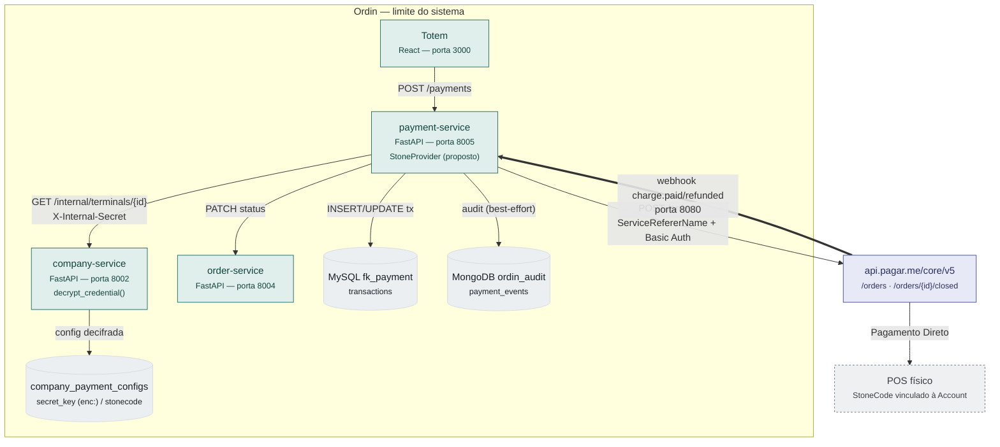
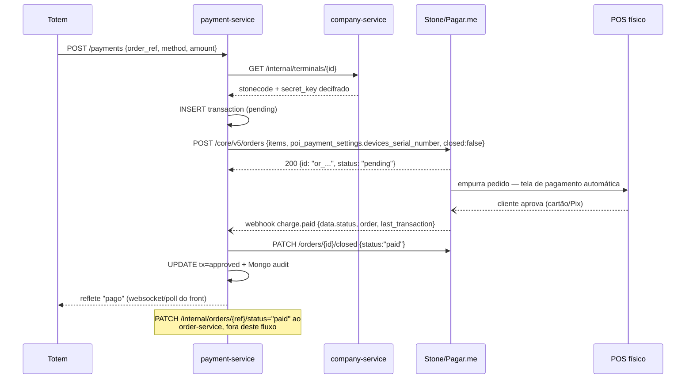
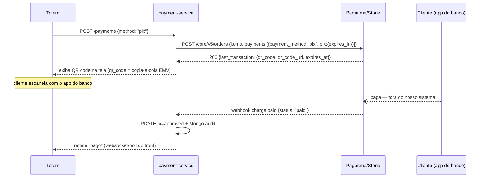

# Análise — Modelo de integração Stone Connect 2.0

> Leitura da documentação oficial `connect-stone.stone.com.br` (via índice
> `llms.txt`), cruzada com o modelo já implementado no `payment-service`
> (`IPaymentProvider`, `PayGoProvider`, `MPProvider`, `company_payment_configs`).
> Nenhuma linha de código foi escrita — isto é material de exploração, não
> story `Ready`. Objetivo: servir de referência rápida de "como isso funciona"
> e listar o que precisa ser confirmado antes de virar história de
> implementação.

**Decisão registrada (2026-09-05): integração com a Stone será implementada —
excelente opção para o cliente.** Antes de abrir o Explorer, todo item
"Bloqueante" da checklist abaixo precisa de resposta do suporte/gerente
comercial da Stone. Ver `docs/WORKFLOW.md` — nenhuma linha de produção antes
de `Ready`.

## Checklist — perguntas para o suporte Stone (mandar assim que houver acesso)

### 🚨 Bloqueantes — sem resposta, não dá pra escrever o handler com segurança

- [ ] **Assinatura do webhook.** Existe algum mecanismo pra validar que uma
      notificação em `/payments/webhook/stone` realmente veio da Stone (header
      tipo `x-signature`, HMAC, secret configurável, IP de origem fixo)? Busca
      exaustiva em 9 páginas da doc pública (Connect Stone + Pagar.me Gateway,
      incluindo o schema do próprio objeto webhook cadastrado) não encontrou
      nada — ver seção 7. Sem isso, o handler não tem como recusar um payload
      forjado.
- [ ] **Sandbox do fluxo de cartão (POS).** A doc confirma que não existe —
      teste é em produção com cartão real e valores simbólicos (seção 7). Qual
      é o processo de homologação recomendado pra QA automatizado sem gerar
      custo real por execução de CI?
- [ ] **Escopo do `ServiceRefererName`.** É um identificador único da Ordin
      como plataforma (obtido uma vez no cadastro do programa de parcerias), ou
      precisa ser diferente por empresa-cliente? Decide se vira env var global
      ou campo por `company_payment_config` (seção 7).

### ⚠️ Importantes — não travam o design, mas mudam decisões de arquitetura

- [ ] **`AMK` vs `Secret_Key`.** Em qual operação (se alguma) é obrigatório
      usar a chave de nível Merchant (`AMK`) em vez da `Secret_Key` de Account?
      Relevante principalmente se formos usar split (seção 6, seção 7).
- [ ] **Conta Gateway/PSP para o Pix na tela.** O fluxo de Pix sem POS (seção
      4) já vem incluso no cadastro do programa de parceiros Stone Connect, ou
      exige contratação/habilitação comercial separada como cliente
      Gateway/PSP Pagar.me?
- [ ] **Participante direto do Pix.** Emitir QR code Pix exige conta com
      participante direto do Pix (seção 4) — essa exigência recai sobre a
      Ordin (plataforma) ou sobre cada empresa-cliente individualmente?
- [ ] **Split obrigatório desde fev/2026?** Todo pedido criado via PDV
      precisa do campo `split` mesmo sem marketplace (ex.: 100% para um
      `recipient_id` fixo), ou só quando há de fato divisão entre recebedores
      (seção 6)?
- [ ] **Endpoint completo de cadastro de recebedor** (`recipient`) — payload
      completo (dados bancários, documento, KYC). Só bloqueia se formos usar
      split desde o início (seção 7).

### 💡 Menores — confirmar, mas não bloqueiam o desenho

- [ ] **Janela do estorno.** O `DELETE /charges/{id}` (seção 7) tem prazo
      máximo após a liquidação, como os 90 dias documentados no guia
      conceitual de Pix? Aplica igual pra cartão?
- [ ] **Modelos de POS (T8, P2A11).** Já voltaram a ser suportados? Qual
      modelo recomendam pro piloto (seção 7)?

Cada item aponta pra seção com o contexto completo — não mandar a pergunta
solta sem reler a seção antes, o gerente comercial vai perguntar "no contexto
de quê".

## 0. O que é o Connect Stone 2.0, em uma frase

É a camada de integração entre o sistema do parceiro (PDV/e-commerce — no
nosso caso, o totem) e a maquininha física, construída sobre a **API core v5
da Pagar.me** (a Stone adquiriu a Pagar.me e reaproveita a API dela como
back-end do Connect). Ou seja: tecnicamente, integrar com "Stone Connect" é
integrar com `api.pagar.me`.

## 1. Diagrama de contexto (C4 nível 1)

Diferente do PayGo (`docs/analise-paygo-modelo-integracao.md`), aqui o Ordin
**não faz polling** — o modelo nativo já é *push*: o totem cria um "Pedido",
o POS físico entra sozinho na tela de pagamento, e a Stone avisa por webhook
quando a cobrança é paga.

```mermaid
flowchart LR
    operador(["👤 Operador<br/><small>totem / caixa</small>"])
    ordin["Ordin<br/><small>FoodKiosk — autoatendimento multi-tenant</small>"]
    stone["Stone Connect 2.0<br/><small>api.pagar.me/core/v5 — orders/charges</small>"]
    pos["POS físico<br/><small>maquininha Stone — StoneCode</small>"]
    adquirente["Adquirente / Bandeira<br/><small>por trás da Stone</small>"]

    operador -- usa --> ordin
    ordin -- "cria Pedido<br/>POST /orders · Basic Auth (SK)" --> stone
    stone -- "empurra pedido<br/>Pagamento Direto" --> pos
    pos <-- "captura / autoriza" --> adquirente
    stone == "webhook charge.paid / charge.refunded<br/>porta 8080 · sem polling" ==> ordin

    classDef internal fill:#e1efec,stroke:#1f6f68,color:#12433e;
    classDef external fill:#e8e9f6,stroke:#454f86,color:#2a3060;
    classDef hw fill:#eef0f2,stroke:#6b7280,stroke-dasharray: 3 3,color:#3a3f45;
    classDef person fill:#12433e,stroke:#12433e,color:#fff;
    class ordin internal
    class stone external
    class pos,adquirente hw
    class operador person
```



O Ordin nunca fala com a maquininha nem com a adquirente diretamente — só com
a API da Stone/Pagar.me. A seta grossa (`==>`) é o webhook: ao contrário do
PayGo (onde o webhook é proposto/não implementado), aqui **é o mecanismo
padrão documentado**, não uma alternativa ao polling.

## 2. Diagrama de contêineres (C4 nível 2)

Mesmo padrão de segredo do PayGo: credencial criptografada no
`company_payment_configs`, decifrada pelo company-service, nunca em texto puro
no MySQL do payment-service.



Nada disto está implementado — é o desenho equivalente ao que já existe para
PayGo/Mercado Pago, só trocando o provider.

## 3. Dois modelos de operação — qual serve ao Ordin

A doc (`docs/operações.md`) descreve dois fluxos dentro da mesma API de
pedidos, e a diferença é só o campo que dispara a entrada automática no POS:

| | Listagem de Pedidos | Pagamento Direto |
|---|---|---|
| Iniciativa | Operador escolhe o pedido na tela do POS | Sistema cria o pedido já mirando um POS específico |
| Uso típico | Comanda de mesa, pagamento parcial/misto | Fluxo linear tipo totem — 1 pedido, 1 pagamento |
| Equivalente no Ordin hoje | Não existe — não temos "lista de pedidos abertos" no POS | **Este é o nosso caso** — equivalente ao Modo Ativo do PayGo |

**Pagamento Direto** é o análogo funcional do "Modo Ativo" do PayGo (seção 3
do doc PayGo): o Ordin cria o pedido, a maquininha entra sozinha na tela de
pagamento, sem o operador escolher nada.



Diferença estrutural para o PayGo: **não existe passo de polling**. O
`payment-service` só volta a falar com a Stone depois do webhook, e só para
fechar o pedido (`PATCH .../closed`) — não para perguntar o status, que já
veio pronto no payload.

### Fechar o pedido é responsabilidade nossa, e tem prazo prático

`closed: false` é obrigatório na criação (senão nem aparece no POS). Depois
do `charge.paid`, é preciso chamar `PATCH /orders/{id}/closed` — a doc é
explícita: "parceiros devem fechar pedidos após a confirmação de pagamento
via webhook" para o POS não parar de exibir pedidos novos. Existe também um
**limite de 30 pedidos abertos simultaneamente** — relevante para dimensionar
qualquer rotina de limpeza/expiração de pedidos travados em `pending`.

### Cancelamento — só antes da captura, sem estorno automático

`PATCH /orders/{id}/closed {status:"canceled"}` só funciona **antes** do
pagamento ser efetivado — não cancela nem estorna cobrança já aprovada
(diferente do `refund_transaction` que o Ordin já modela na interface
`IPaymentProvider`, ORD-147). Reembolso pós-aprovação é operação separada
(manual via POS/Portal Stone segundo a doc lida — API de estorno programático
não veio no material lido, ver pendências).

## 4. Pix na tela — modelo Mercado Pago (via Pagar.me Gateway, sem POS)

Pergunta direta: dá pra ter o mesmo modelo do Mercado Pago (QR exibido na tela
do totem, sem acionar nenhum terminal físico)? **Sim** — mas não pela
documentação do Connect Stone, e sim pela documentação geral da Pagar.me
(`docs.pagar.me`), que é a mesma plataforma por baixo do Connect Stone.

### Dois produtos Pix diferentes, dentro do mesmo host

| | Pix via POS (Connect Stone) | Pix via Gateway (Pagar.me) |
|---|---|---|
| Onde está documentado | `connect-stone.stone.com.br` | `docs.pagar.me` |
| Como aciona | `poi_payment_settings.payment_setup.type: "pix"` + `devices_serial_number` | `payments: [{ payment_method: "pix", pix: {...} }]` — **sem** `poi_payment_settings` |
| Quem mostra o QR | O **POS físico**, na tela dele | A resposta da API já traz o QR — quem mostra é o **nosso totem** |
| Host/endpoint | `POST api.pagar.me/core/v5/orders` | **O mesmo endpoint**, `POST api.pagar.me/core/v5/orders` |
| Equivalente PayGo | `formaPagamentoId=25` (Pix no terminal) | Gate2all (mas aqui não é produto à parte — é o mesmo `core/v5`) |

Diferente do PayGo — onde Pix-na-tela (Gate2all) tem host e autenticação
próprios, um produto totalmente separado — aqui é **o mesmo endpoint e a
mesma autenticação** (`Secret_Key` via Basic Auth) que já usamos para o
Pagamento Direto (seção 3). Só muda o objeto dentro de `payments`.

### Fluxo (mesmo padrão do Mercado Pago já implementado)



Mesmo mecanismo de webhook já confirmado na seção 1 (push, sem polling) — não
é um modelo novo de notificação, é o mesmo `charge.paid` de qualquer outro
método de pagamento nesse core.

### O que a resposta traz

`last_transaction.qr_code` é o próprio **código copia-e-cola EMV** (string,
não base64) e `last_transaction.qr_code_url` é uma URL pra imagem do QR já
pronta — mais completo do que o PayGo/Gate2all, onde o formato do QR não
tinha sido confirmado pela doc lida naquela análise.

### Pendências específicas deste modelo

- **Requer conta "Gateway ou PSP Pagar.me"** — a página de criação de pedido
  desse fluxo é explícita: *"disponível para clientes Gateway e PSP
  Pagar.me"*. Não está confirmado se isso já vem incluso no cadastro do
  programa de parceiros Stone Connect (seção "Pontos a confirmar") ou se é
  uma contratação/habilitação comercial separada — perguntar ao gerente
  comercial junto com a dúvida sobre `ServiceRefererName`.
- **Participante direto do Pix** — a doc menciona que **emitir** QR code
  exige conta com um participante direto do Pix; para **receber**, "nenhuma
  informação além do cadastro" seria necessária (a Pagar.me age como a
  instituição financeira). Não ficou claro se essa exigência recai sobre a
  Ordin (plataforma) ou sobre cada empresa-cliente individualmente.
- **Estorno:** até 90 dias após a liquidação, total ou parcial — mais
  generoso que o prazo que normalmente vemos em cartão, e compatível com o
  contrato de `refund_transaction()` (ORD-147/148/149).
- 💡 **Bônus — existe simulador de Pix**, e isso amacia (só para Pix) o
  achado crítico da seção "Pontos a confirmar" sobre não haver sandbox:
  valores até R$ 500 aprovam sozinhos como `paid` alguns segundos depois de
  criados; acima de R$ 500 falham propositalmente — dá pra automatizar teste
  de Pix sem gastar dinheiro real. Limitação registrada na doc: **não
  funciona junto com Split** (seção 6).

## 5. Credenciais — o que é o quê

| Campo | Nome Stone/Pagar.me | Para que serve | Onde viveria no Ordin |
|---|---|---|---|
| `Secret_Key` (SK) | Chave de autenticação da Account | Autentica toda chamada — vai em `Authorization: Basic base64(SK:)`, senha vazia | `company_payment_configs.api_key` (criptografado `enc:`), igual ao padrão PayGo/MP |
| `ServiceRefererName` | ID do parceiro no Stone Partner Program | Header obrigatório em toda chamada — identifica **o Ordin como integrador**, não a empresa-cliente | Provavelmente **variável de ambiente global** do payment-service, não por empresa (ver pendência abaixo) |
| `StoneCode` (SC) | ID do estabelecimento dentro da Stone | Vincula o pedido a um POS físico específico (via `devices_serial_number`) | `terminals.<novo campo>`, análogo a `terminals.paygo_terminal_id` |
| `AMK` | Chave de autenticação nível Merchant | Mencionada em "Conceitos", mas **não aparece** na página de Autenticação da API Reference como mecanismo real de auth | Não mapeado — ver pendência |

## 6. Split de pagamento / "Prateleira Infinita" — marketplace nativo

Diferente do PayGo (onde Pix-na-tela é um produto totalmente à parte,
Gate2all, com host e auth próprios), o split da Stone **é o mesmo endpoint**
de criação de pedido — só adiciona um array `poi_payment_settings.payment_setup.split`:

```json
{
  "split": [
    { "amount": 70, "recipient_id": "rp_XXXX", "type": "percentage",
      "options": { "liable": true, "charge_remainder_fee": true, "charge_processing_fee": true } },
    { "amount": 30, "recipient_id": "rp_YYYY", "type": "percentage",
      "options": { "liable": false, "charge_remainder_fee": false, "charge_processing_fee": false } }
  ]
}
```

**Isso não é hipotético para o Ordin** — o modelo multi-tenant já tem o
conceito de "empresa" recebendo por um produto vendido; se algum dia existir
split entre a Ordin (plataforma) e a empresa-cliente (taxa de uso cobrada por
transação em vez de fatura), este é o mecanismo nativo pra isso, sem precisar
de um gateway externo. Hoje não há nenhum `recipient_id` nem conceito de
"recebedor" no schema do Ordin — seria arquitetura nova, análogo ao que a
seção 7 do doc PayGo propõe para o Gate2all, mas aqui já é parte documentada
da mesma API core, não um produto terceiro.

**Desde fevereiro de 2026, a doc afirma que passou a ser obrigatório enviar
regras de split já na criação do pedido via PDV** — vale confirmar se isso
significa que *todo* pedido precisa do campo `split` mesmo sem marketplace
(ex: 100% para um único `recipient_id` fixo), o que mudaria o payload mínimo
de integração mesmo no caso simples do totem.

## 7. Pontos a confirmar antes de virar story

Vieram de leitura automatizada das páginas de `connect-stone.stone.com.br` —
tratar como pistas a verificar com o gerente comercial/documentação completa
antes de qualquer implementação de produção.

### 🚨 Não existe sandbox — teste é em produção com dinheiro real

A doc é explícita: *"não disponibilizamos um ambiente de sandbox ou simulador
virtual"*. A orientação oficial é usar valores simbólicos (R$ 1,00) e
cancelar/estornar imediatamente após confirmar a transação.

**Por quê importa:** isso na verdade **já é exatamente** o que o
`test_connection()` da nossa `IPaymentProvider` faz hoje para PayGo/MP
("aciona a máquina com R$ 0,01 e cancela imediatamente") — não é um método
novo a inventar, é reaproveitar o padrão existente. Mas muda o processo de
homologação/QA: não dá para ter um ambiente de CI isolado batendo na Stone
como se faz (hipoteticamente) com sandbox de outros providers — todo teste
automatizado teria custo real e precisa de cartão físico.

### ⚠️ `ServiceRefererName` — escopo pouco claro

A doc descreve como "ID único de referência da empresa parceira com o Stone
Partner program" — soa como um identificador **do Ordin como plataforma**
(obtido uma vez no cadastro do programa de parcerias), não por
empresa-cliente do Ordin. Se for isso, é uma env var global do
payment-service (tipo `STONE_SERVICE_REFERER_NAME`), diferente do padrão
atual onde toda credencial é por `company_payment_config`. Precisa confirmar
com o gerente comercial da Stone durante o cadastro no programa de parceiros
(`docs/processo-de-integração.md` — etapa 1).

### ⚠️ `AMK` vs `Secret_Key` — qual usar em qual chamada

"Conceitos" define AMK como chave de nível Merchant, mas a página de
Autenticação da API Reference só documenta Basic Auth com `Secret_Key`
(nível Account). Não ficou claro se existe alguma operação (ex: cadastro de
recebedor, consulta multi-conta) que exige AMK em vez de SK. Relevante para o
cenário de split (seção 6), onde potencialmente uma chamada precisa ser feita
no nível Merchant (dono de várias Accounts) em vez de Account.

### ⚠️ Endpoint de cadastro de recebedor (`recipient`) não veio completo

A página `cadastro-de-recebedores` só descreve o objeto `recipient` e
redireciona para "a documentação da pagar.me" sem lincar a URL específica. Sem
isso não dá pra saber o payload completo (dados bancários, documento,
KYC) necessário pra qualquer fluxo de split.

### 🚨 Webhook — sem assinatura documentada em lugar nenhum (busca exaustiva)

`retorno-webhook` deu o schema completo (`type`, `data.status`,
`data.last_transaction`, etc.), mas nenhuma das duas trilhas do Connect
Stone nem a doc geral da Pagar.me Gateway confirmam um mecanismo de
assinatura. Verificado especificamente em 2026-09-04, sem achar nada em
nenhuma das páginas abaixo:

- `connect-stone.stone.com.br/reference/webhook` **e** `webhook-1` (segunda
  trilha) — nenhuma menção a header de assinatura, secret ou IP whitelist.
- `connect-stone.stone.com.br/reference/retorno-webhook-1` — schema do
  payload de `charge.paid` com `metadata` expandido (cartão, autorização,
  parcelas), mas **sem nenhum campo de hash/assinatura**.
- `docs.pagar.me/docs/webhooks` e `reference/visão-geral-sobre-webhooks` —
  só confirmam política de retry configurável e um endpoint pra consultar
  webhooks que falharam; zero menção a HMAC/`x-signature`.
- `docs.pagar.me/reference/listar-webhooks` e `reference/obter-webhook` — o
  **schema do próprio objeto webhook cadastrado** (`id`, `url`, `event`,
  `status`, `attempts`, `response_status`...) também não tem nenhum campo
  `secret`/`signing_secret`/`authentication_token`.
- A FAQ do Connect Stone aponta um "Developer Guide" em Google Docs
  (`docs.google.com/document/d/1qzalIZqcJYq9Awgr6ARAfcF-oQeRFlFiZs9VlT7tpUI`)
  como referência adicional — não acessível sem login/permissão do parceiro;
  é candidato natural a esconder esse detalhe, mas precisa ser aberto por
  quem tiver acesso ao cadastro do programa de parceiros, não por leitura
  automatizada.

**Isso é diferente de "não confirmei ainda" — é ausência real na
documentação pública.** Compare com o Mercado Pago, que documenta
`x-signature` publicamente e o Ordin já valida em `_get_mp_webhook_secret`.
Sem confirmação (via account manager ou o Developer Guide), duas opções
antes de expor `/payments/webhook/stone` em produção:

1. **Perguntar direto** — este é o tipo de pergunta que só o time de
   integração da Stone responde; documentação pública não cobre.
2. **Mitigação arquitetural, independente da resposta:** nunca confiar cegamente
   no `status` que vem no payload do webhook — usá-lo só como *gatilho* para
   chamar `GET /orders/{id}` (ou `GET /charges/{id}`) e confirmar o estado
   direto na Stone antes de marcar a transação como aprovada. Isso neutraliza
   um payload forjado (quem forjar não consegue fazer a Stone responder
   "paid" numa consulta real), ao custo de reintroduzir uma chamada de
   confirmação — o mesmo padrão de "push-triggered single-fetch" que a seção
   6 do doc PayGo propõe para o `Callback/Insert` do ControlPay. Se a Stone
   confirmar que existe assinatura, essa consulta extra deixa de ser
   obrigatória e vira só uma rede de segurança.

### ⚠️ Modelos de POS temporariamente fora da lista

T8 e P2A11 removidos "para ajustes técnicos" (sem data de retorno) — se o
piloto depender de um desses modelos, checar disponibilidade atual antes de
prosseguir com a compra do equipamento.

### ✅ Resolvido — Reembolso pós-captura tem endpoint programático

A leitura anterior (só a página `cancelamento-de-pedido` do Connect Stone)
levou à conclusão errada de que reembolso seria só manual. Existe uma
segunda página, da mesma família mas de outra trilha —
`reference/cancelamento-de-pedido-1` (rotulada **"Cancelamento de
Cobrança"**) — que é exatamente o estorno programático que faltava:

```
DELETE https://api.pagar.me/core/v5/charges/{charge_id}
```

- **Sem `amount` no body** → estorna o valor integral.
- **Com `amount` (em centavos)** → estorno parcial.
- Aceita `split` no body pra distribuir o estorno entre múltiplos
  recebedores (mesma mecânica da seção 7), com as mesmas opções
  (`charge_processing_fee`, `liable`, `charge_remainder_fee`).
- Resposta esperada: `200` com objeto vazio `{}`.
- Confirma via webhook `charge.refunded` (já mapeado na seção 1).

**Isso resolve a pendência com o contrato de `refund_transaction()`**
(`IPaymentProvider`, ORD-147/148/149) — a Stone cumpre o contrato de
reembolso via API como qualquer outro provider já integrado. O que ainda
falta confirmar: se esse endpoint tem prazo/janela de reembolso diferente
do `PATCH /orders/{id}/closed` (cancelamento pré-captura, seção 3) e se
falha silenciosamente fora de alguma janela — não veio na leitura atual.

## 8. Fontes

Leitura automatizada (resumo por IA) das páginas abaixo, via índice
`https://connect-stone.stone.com.br/llms.txt`, em 2026-09-04 — tratar como
pistas a confirmar na íntegra, não como fato assentado, antes de mexer em
produção:

- `docs/o-que-é-a-api-connect-20`, `docs/conceitos`, `docs/operações`,
  `docs/dispositivos-suportados`, `docs/documentação-técnica`,
  `docs/processo-de-integração`
- `reference/visão-geral`, `reference/autenticação-copy` (Ambiente),
  `reference/autenticação-copy-1` (Autenticação), `reference/criar-pedido`,
  `reference/webhook`, `reference/webhook-1`, `reference/retorno-webhook`,
  `reference/retorno-webhook-1`, `reference/fechamento-de-um-pedido`,
  `reference/cancelamento-de-pedido`, `reference/cancelamento-de-pedido-1`
  (**"Cancelamento de Cobrança"** — é o estorno pós-captura, seção 7 acima),
  `reference/split-no-pedido`, `reference/cadastro-de-recebedores`,
  `reference/conciliação-transacional`, `reference/poi-payment-settings`,
  `reference/itens`, `page/faq`

Seção 4 (Pix na tela) e a investigação de webhook/reembolso vieram de um
índice **separado**, o geral da Pagar.me —
`https://docs.pagar.me/llms.txt` — que documenta o produto Gateway/PSP por
trás do mesmo host `api.pagar.me`, mas não faz parte da doc do Connect
Stone: `reference/criar-pedido-2`, `reference/pix-2`, `docs/pix-1` (guia
conceitual), `docs/simulador-pix`, `docs/webhooks`,
`reference/visão-geral-sobre-webhooks`, `reference/eventos-de-webhook-1`
(catálogo completo — 65 eventos, não só `charge.*`), `reference/listar-webhooks`,
`reference/obter-webhook` (schema do objeto webhook cadastrado — sem campo
de assinatura/secret).

Não lidas em detalhe nesta sessão (candidatas a aprofundar antes de virar
story): `reference/customer`, `reference/impressão-de-nota-fiscal`,
`reference/obter-pedido` (Connect Stone); `reference/incluir-cobrança-no-pedido`,
`reference/obter-cobrança`, `reference/enviar-webhook`,
`reference/exemplo-de-webhook-1` (Pagar.me Gateway). O FAQ do Connect Stone
aponta ainda um "Developer Guide" em Google Docs, não acessível por leitura
automatizada — candidato a pedir direto ao account manager da Stone.
