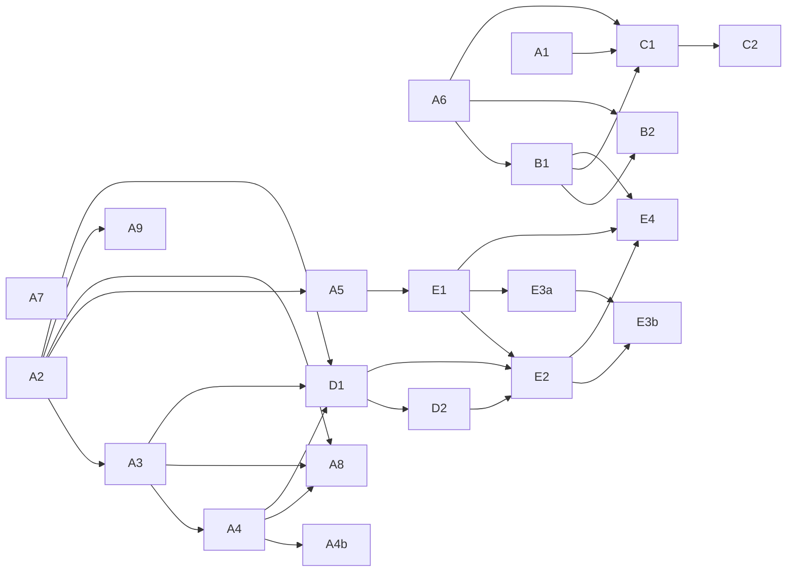

# Estudo — Módulo de Estoque/ERP (entrada de NF, baixa automática, vínculo com catálogo)

Levantamento de mercado + esboço técnico inicial pra um possível módulo novo do Ordin: entrada de
NF de compra via XML, controle de estoque, vínculo automático com produto do catálogo, baixa
automática por venda, e fila de pendência pra item sem vínculo. **Isto é levantamento, não uma
história pronta** — nenhum código foi escrito, nenhuma história aberta. Segue o mesmo espírito dos
levantamentos já feitos pra Stone/Adyen/PagBank (`docs/analise-*-modelo-integracao.md`) e NFC-e
(`docs/estudo-nfce.md`): pesquisa real, com fontes, antes de qualquer Explorer formal.

---

## ✅ Terminologia confirmada — era SKU, não NSU

O pedido original usava o termo "NSU" pra descrever o vínculo entre item da NF e produto do
catálogo. O usuário confirmou depois que foi lapso de digitação: o termo certo é **SKU**, não NSU
(que, tecnicamente, é um conceito fiscal de nível de *documento* — número que a SEFAZ atribui a
cada evento na distribuição de NF-e — sem relação com identificar item/produto; esse desvio já
tinha sido sinalizado na primeira versão deste documento).

Com "SKU" confirmado, o vínculo é entre o código do item no XML da NF-e (tag `<det><prod>`,
principalmente `cProd` — código do fornecedor — e `cEAN`/`cEANTrib` — código de barras, quando
preenchido) e o campo **`Product.sku` que já existe hoje no `catalog-service`** (ver seção
"Contexto interno" abaixo). Hoje esse campo é de preenchimento livre/manual, sem qualquer relação
com código de fornecedor ou EAN real — é exatamente essa lacuna que o módulo de estoque preencheria
(ou precisaria de um campo de EAN dedicado, complementar ao SKU interno; ver seção técnica).

---

## Resumo executivo

- **O padrão de mercado é unânime**: nenhum sistema pesquisado (ERP genérico ou POS de food
  service) usa NSU fiscal pra vincular item↔produto — todos usam código do fornecedor (`cProd`)
  e/ou código de barras (`cEAN`), com fallback pra correspondência por nome.
- **A "fila de pendência" que o usuário pediu já é o padrão de mercado**, não uma ideia nova: todo
  ERP pesquisado (Bling, Omie, ContaAzul, GestãoClick, CPlug) trata item sem vínculo automático
  como um estado explícito e reversível — nunca cria produto novo sem confirmação, nunca bloqueia
  a nota inteira por causa de um item não reconhecido.
- **Ficha técnica/receita (BOM) é a funcionalidade de maior sinal combinado** entre "o que os
  concorrentes de food service já têm" e "o que faz o módulo valer a pena pro cliente do Ordin":
  sem ela, dar baixa de estoque por venda só funciraria pra itens revendidos prontos (bebida
  industrializada), não pra pratos preparados — que são a maioria do cardápio de um cliente típico
  do Ordin (hambúrguer, massa, etc.). Confirma a suspeita already levantada em
  `docs/analise-gap-features-roadmap-futuro.md`.
- **Conversão de unidade de medida (compra em kg, consumo em grama/porção) é pré-requisito técnico
  da ficha técnica**, não um extra — sem isso, a baixa automática por receita não fecha a conta.
- **O Ordin já decidiu explicitamente, no épico fiscal, que este módulo fica de fora daquele
  escopo** (`docs/estudo-nfce.md`, "Decisão explícita: nenhuma importação de NF de entrada / módulo
  de estoque antes deste épico [...] um módulo de estoque/ERP seria um épico à parte, muito maior").
  Este documento é o primeiro passo desse épico à parte.

---

## Contexto interno já mapeado

### O que o `catalog-service` já tem (`services/catalog/main.py`)

`Product` (linha 129) já tem, graças ao ORD-169 (cadastro fiscal do produto pro épico NFC-e):
- `sku` (`String(50)`, único por empresa via `UniqueConstraint("company_id", "sku")`) — **é o
  candidato natural pra ser o campo de vínculo com `cProd`/`cEAN` do XML**, mas hoje é de
  preenchimento livre/manual, sem relação com nenhum código de fornecedor ou EAN real.
- `ncm` (FK pra `ncm_codes`, tabela local sincronizada via `scripts/sync_ncm.py` com a API pública
  do Sistema Classif da Receita Federal), `cfop`, `cest` — classificação fiscal por item, já usada
  hoje pelo `payment-service` pra montar a NFC-e de saída (`_build_nfce_payload`).
- **Não existe hoje** nenhum campo de EAN/código de barras dedicado, nem unidade de medida, nem
  qualquer noção de estoque/quantidade — `active`/`deleted` só controlam disponibilidade manual do
  item no cardápio, não quantidade física.

### O que o `payment-service` já faz com dado fiscal (`services/payment/main.py`)

`_build_nfce_payload` (linha 233) já busca `ncm`/`cfop`/`cest` por produto (via chamada interna ao
catalog-service) pra montar a nota de **saída** (venda). `compute_icms_situacao_tributaria`
deriva CST/CSOSN a partir do regime tributário da empresa + presença de CEST no item. Isso é
reaproveitável: um item de estoque vinculado a um `Product` já herda a classificação fiscal que
esse produto já tem — não precisa duplicar NCM/CFOP/CEST numa tabela de estoque nova.

### Decisão já registrada de manter os escopos separados

O próprio épico fiscal (`docs/estudo-nfce.md`, seção "3.2") fechou a porta explicitamente pra não
misturar os dois problemas: rastrear XML de compra resolveria "se o ICMS-ST já foi retido na
aquisição" (crédito fiscal), não "se o item deveria ter ST na revenda" (que é propriedade do
NCM/estado). Ou seja, mesmo depois deste módulo existir, o cálculo de ST/CEST da venda continua
sendo responsabilidade do cadastro fiscal do produto (ORD-169), não do módulo de estoque.

---

## O que os concorrentes do Ordin já pesquisados fazem

Cruzando com a lista de referência (`project_ordin_concorrentes_referencia`) e o cruzamento de gap
já feito em `docs/analise-gap-features-roadmap-futuro.md` (item 4, "Estoque + ficha técnica + CMV
automático" — 6 de 12 concorrentes confirmados: CPlug, Consumer, Nola, Mogo, CardápioWeb, Genesis
PRO). Esta pesquisa aprofunda especificamente **importação de XML de compra** e **mecânica de
vínculo**, que o doc de gap não tinha investigado:

| Concorrente | Estoque/ficha técnica confirmado? | Importação de XML de compra confirmada? | Detalhe |
|---|---|---|---|
| **CPlug (ConnectPlug)** | Sim | **Sim, confirmado** | Módulo dedicado "Facilita NFe" (webinar próprio) — caminho `ERP > Estoque > Compras > Entrada de NF-e`. Ao importar, reconhece fornecedor já cadastrado (ou pede cadastro na hora) e sugere nome de produto a partir do XML, editável. Estoque e contas a pagar são atualizados junto. |
| **Consumer** | Sim | **Sim, confirmado** | Artigo de ajuda dedicado ("Como fazer a entrada de estoque via arquivo XML de Nota de Entrada NFe") — fluxo `Produtos → Alterar Estoque com NFe`, clique por item pra vincular ao produto já cadastrado; fornecedor novo do XML é auto-cadastrado. Baixa automática de estoque por venda também confirmada (inclusive por canal: PDV, delivery, iFood). |
| **Colibri (NCR)** | Sim | Não confirmado nesta rodada | Módulo "Back Office" tem controle de estoque multi-loja, custo médio, CMV e ficha técnica — mas a pesquisa não achou confirmação específica de importação de XML de compra (só o módulo de estoque em si). |
| **Mogo, CardápioWeb, Nola, Genesis PRO** | Sim (já confirmado no doc de gap) | Não pesquisado nesta rodada | O doc de gap já confirma "estoque" como funcionalidade, mas não detalha o mecanismo de importação de XML — ficaria pra uma rodada de aprofundamento futura se o Ordin avançar com este módulo. |
| **StarSoft** | Não confirmado | Não confirmado | Buscas retornaram resultado ambíguo (confundido com "Colibri" via distribuidor/revenda) — não há confirmação direta e independente de um produto "StarSoft" com módulo de estoque próprio nesta pesquisa; tratar como não confirmado, não como "não tem". |

**Leitura**: dos concorrentes diretos do Ordin (food service pequeno/médio, não os adjacentes
Nola/Zig/PagTotem), pelo menos **2 de 2 pesquisados a fundo** (CPlug e Consumer) confirmam
importação de XML de NF de compra com exatamente o padrão "vínculo automático por nome/código,
fila manual pro que não bate" que o usuário descreveu — reforça que não é uma ideia fora do padrão
de mercado, é tabela stakes pra quem já vende módulo de estoque.

**Nenhum concorrente pesquisado cobra separado especificamente pela importação de XML de compra**
— ao contrário do padrão já mapeado em `project_concorrentes_modelo_cobranca` pro totem em si (que
tem 4 modelos distintos de cobrança), a importação de XML aparece sempre como parte do módulo de
estoque/compras já incluído no plano que tem esse módulo, sem cobrança adicional por volume de
notas importadas nos casos pesquisados. Ressalva: nenhum dos concorrentes publica detalhamento de
preço granular o suficiente pra confirmar isso com certeza (mesmo padrão de opacidade de preço já
registrado em `project_concorrentes_modelo_cobranca`).

---

## O que os ERPs de mercado fazem

| ERP | Importação de XML | Vínculo item↔produto | O que acontece sem vínculo automático | Baixa automática por venda | Conversão de unidade | Fonte |
|---|---|---|---|---|---|---|
| **Bling** | Sim | Concilia por vínculo com Pedido de Compra prévio, ou por conferência manual item a item ("Conciliar produtos") | Produto novo é **criado a partir da nota** (com confirmação); produto já existente pode ter estoque atualizado a partir do lançamento da nota | Sim (padrão de ERP de e-commerce/varejo) | Não confirmado especificamente | [Bling – Vincular itens](https://ajuda.bling.com.br/hc/pt-br/articles/21830391097367), [Conciliar produtos](https://ajuda.bling.com.br/hc/pt-br/articles/360044990973) |
| **Tiny ERP** | Sim | Por **nome ou código**, configurável (`Estoque > Opções auxiliares > Configurações`); tem opção explícita de **priorizar EAN como vínculo principal** mesmo se outro campo também bater | Fica pendente pra vínculo manual (duplo clique pra linkar a cadastro existente) | Sim | Não confirmado especificamente | [Marketfacil – Tiny XML](https://marketfacil.com.br/contabilidade/importar-xml-nfe-tiny-erp/) |
| **Omie** | Sim | **Automático por código do item bater com código já cadastrado no Omie** | Item fica marcado com **❗ (exclamação)** — sinalização visual explícita de pendência, requer vínculo manual antes de fechar a importação | Sim (módulo "Compras, Estoque e Produção") | Sim (mencionado no módulo, não detalhado) | [Omie – Nota de Importação](https://ajuda.omie.com.br/pt-BR/articles/6803961-perguntas-frequentes-nota-de-importacao) |
| **ContaAzul** | Sim | Por busca manual de produto existente (`Trocar > Buscar produto`) ou criação de novo produto a partir da nota | Fluxo explícito de "Novo Produto" com dados pré-preenchidos do XML, exceto NCM/CEST/Origem — esses **sempre exigem ajuste manual**, mesmo vindo do XML | Sim | **Sim, com nome de feature próprio** ("Produtos: conversão de unidade de medida") | [ContaAzul – Vincular compra](https://ajuda.contaazul.com/hc/pt-br/articles/9936132578573), [Conversão de unidade](https://ajuda.contaazul.com/hc/pt-br/articles/27381110462349) |
| **GestãoClick** | Sim (inclusive **importação direto da SEFAZ**, não só upload manual de arquivo) | Por nome ou código, configurável (mesma mecânica do Tiny) | Oferece 3 opções explícitas por item: **criar novo cadastro / não criar / vincular a existente** — o item pendente é buscável e linkável a qualquer momento | Sim, condicionado a "situação da compra" estar configurada pra movimentar estoque | Não confirmado especificamente | [GestãoClick – Importar por NF-e](https://ajuda.gestaoclick.com.br/hc/pt-br/articles/33490521395351) |
| **TOTVS** (linhas RM/Protheus/Winthor) | Sim, múltiplas linhas de produto com módulo de importação próprio | Varia por linha — Protheus (SIGACOM) tem "Regras para importar NFe" configuráveis; foco mais forte em automação de conferência (evitar erro de digitação) do que em UX de vínculo simples | Não detalhado nesta pesquisa — TOTVS é suíte enterprise, documentação fragmentada por linha de produto (RM, Protheus, Winthor, Datasul), não achamos um fluxo único comparável aos ERPs SaaS acima | Sim | Sim (ERPs de manufatura da TOTVS têm conversão de unidade nativa) | [TOTVS – Importação XML](https://centraldeatendimento.totvs.com/hc/pt-br/articles/5552805375255) |
| **SAP Business One** (+ extensão "Food One") | Localização brasileira suporta NF-e desde 2010 (obrigatoriedade nacional) | Não pesquisado em detalhe — fora do porte-alvo do Ordin | — | Sim, com rastreabilidade de lote/validade e recall (extensão Food One) | Sim (ERP de manufatura, nativo) | [SAP Business One Food & Beverage](https://softengine.com/industry/food-and-beverage/) |
| **NFE.io** | Não é um ERP — é infraestrutura de emissão/consulta fiscal (API), não achamos evidência de módulo de importação/vínculo de estoque próprio | — | — | — | — | Não aprofundado — fora de escopo como fonte de estoque, mas mencionado no pedido original como referência de "parsing fiscal"; o mais próximo do que o Ordin já pesquisou pra emissão é a comparação de provedores em `docs/estudo-nfce.md` (Focus NFe, PlugNotas, Nota Gateway) |
| **Linx** | Sim (linha Microvix/UX, "Entrada XML NF-e") | Não detalhado a fundo nesta pesquisa | — | Sim | Não confirmado especificamente | [Linx Share – Entrada XML](https://share.linx.com.br/pages/viewpage.action?pageId=168823825) |

**Padrão transversal, confirmado em 6 de 6 ERPs pesquisados em profundidade (Bling, Tiny, Omie,
ContaAzul, GestãoClick, CPlug)**:
1. **Nunca é 100% automático nem 100% manual** — todos tentam casar automaticamente por
   código/EAN primeiro, com fallback pra nome, e sempre deixam uma via de vínculo manual explícita
   pro que não bateu.
2. **Nunca bloqueia a nota inteira** por causa de 1 item sem vínculo — o item fica marcado (ícone,
   estado "pendente", contador), o resto da nota segue seu fluxo.
3. **Nunca cria produto novo silenciosamente** — sempre pede confirmação antes de decidir "é
   produto novo" vs. "é o mesmo produto com nome diferente".
4. **NCM/CEST/classificação fiscal do item, mesmo vindo do XML do fornecedor, é tratado como
   dado que precisa de revisão humana** (ContaAzul é explícito sobre isso) — não dá pra
   simplesmente herdar o NCM que o fornecedor colocou na nota dele pro cadastro de produto de
   quem compra, porque a classificação fiscal de quem compra pode ser diferente (ex.: o
   fornecedor vende como insumo genérico, o comprador usa como ingrediente de prato preparado com
   CFOP de produção própria).

---

## Ficha técnica / receita (BOM) — achado mais forte da pesquisa

Confirmado como funcionalidade central em **todos** os sistemas de food service pesquisados
(Colibri/NCR, Consumer, Sischef, VEX Menu, Saipos, CardápioWeb, Anota AI) — não é um recurso de
nicho, é o que diferencia um "estoque de restaurante" de um estoque genérico de varejo:

- **Mecânica confirmada**: o produto vendável (ex. "X-Burger") não é ele mesmo uma unidade de
  estoque — ele tem uma **composição** (pão, carne, queijo, cada um com quantidade), e cada venda
  dá baixa nos insumos da composição, não num "estoque de X-Burger" que precisaria ser reabastecido
  manualmente.
- **Efeito colateral automático confirmado por múltiplas fontes**: quando o cliente remove ou
  adiciona um ingrediente no pedido (ex. "sem cebola", ou um complemento pago), o sistema já ajusta
  a baixa de estoque em tempo real pra refletir a composição real vendida, não a composição padrão
  da ficha técnica — isso conecta diretamente com o mecanismo de **grupos de opção/modificadores**
  que o Ordin já tem (ORD-138/146, `docs/analise-concorrentes-grupos-opcao-produto.md`): a baixa de
  insumo de um produto com opções variáveis precisaria considerar qual opção foi escolhida, não só
  a receita base do produto.
- **CMV (Custo da Mercadoria Vendida) sai de graça uma vez que a ficha técnica existe**: se cada
  insumo tem custo de compra (vindo da própria NF de entrada) e cada produto tem sua composição em
  quantidade de insumo, o custo do prato é calculável automaticamente — os sistemas pesquisados
  (VEX Menu, Sischef) batem exatamente nisso como o valor central do módulo ("CMV real" vs.
  teórico).
- **Consequência pra prioridade**: sem ficha técnica, a "baixa automática de estoque via
  pedido/venda" pedida pelo usuário só funcionaria de verdade pra itens revendidos prontos (ex.
  lata de refrigerante) — que tipicamente são uma minoria do cardápio de um cliente-alvo do Ordin
  (lanchonete/restaurante que prepara comida, não um mercado). Ficha técnica não é um "extra
  desejável", é **pré-requisito pra a funcionalidade #4 do pedido original (baixa automática) fazer
  sentido pro caso de uso principal do produto**.

## Unidade de medida com conversão — pré-requisito técnico da ficha técnica

Confirmado como recurso padrão em todo ERP com módulo de produção/receita pesquisado (ContaAzul
tem feature nomeada, TOTVS/SAP nativos, sistemas de manufatura genéricos como Maxiprod/Nomus). O
mecanismo:
- Produto é comprado numa unidade (ex. kg), mas consumido/estocado em outra (ex. grama) — o
  cadastro guarda um **fator de conversão** entre as duas.
- Um achado específico e reaproveitável: o fator de conversão, uma vez configurado pra uma
  combinação **fornecedor + código do produto no fornecedor + produto do catálogo**, é
  **reaplicado automaticamente** nas próximas importações de XML desse mesmo fornecedor — reduz a
  fricção de recadastrar toda vez que compra do mesmo lugar.
- Sem isso, uma compra de "10kg de queijo" não teria como virar "baixa de 30g por X-Burger vendido"
  sem gambiarra manual de conversão fora do sistema.

## Estoque mínimo / ponto de pedido — confirmado como padrão, mas de esforço menor

Conceito simples e universal (estoque de segurança = consumo médio × tempo de reposição do
fornecedor), citado como recurso padrão em qualquer sistema de estoque de restaurante pesquisado.
Menor prioridade de construção que ficha técnica/conversão de unidade porque **depende delas
primeiro** — só faz sentido alertar "vai faltar queijo" se o sistema já sabe quanto queijo cada
venda consome (via ficha técnica).

## Gestão de fornecedores e pedido de compra — confirmado, mas mais avançado

Presente em ERPs mais maduros (cotação com múltiplos fornecedores, ordem de compra formal,
recebimento de mercadoria como etapa separada da nota fiscal) — mas a pesquisa não achou nenhuma
ferramenta de food service pequeno/médio (o público-alvo do Ordin) com esse nível de sofisticação
como diferencial de venda; parece mais recurso de ERP genérico/industrial do que expectativa de
mercado pro segmento do Ordin. **Essa parte avançada continua de baixa prioridade (Fase 3).**

**Atualização (revisão de quebra em histórias, 2026-09-17)**: o **cadastro simples** de fornecedor
(nome, CNPJ, contato) foi **elevado pro Bloco A (fundação)** a pedido explícito do usuário, que o
considera estrutural — decisão reforçada pelo próprio achado técnico da revisão de backend: o
vínculo automático por código do fornecedor (`cProd`) precisa de fornecedor como entidade real
(tabela `supplier_product_code` com FK), não um cadastro criado de passagem durante o upload do
XML. Virou a história **A6** (ver seção "Quebra INVEST completa" abaixo) — o auto-cadastro a partir
do XML (Bling, CPlug, Consumer fazem isso) continua existindo, mas agora escreve num cadastro que
já existe como entidade de primeira classe desde o início do épico, não é mais a única via de
criação de fornecedor.

---

## Regra de decisão por CFOP — achado da revisão com o usuário

O usuário identificou, revisando este documento, um critério mais preciso do que "Fase 1 sem
ficha técnica, Fase 2 com ficha técnica": **o `Product.cfop`, já cadastrado desde o ORD-169, diz
sozinho qual mecânica de baixa se aplica a cada produto**, sem precisar de uma fase de transição
manual por produto:

- **CFOP 5102** (venda de mercadoria adquirida de terceiros, sem transformação — ex.: refrigerante,
  cerveja, suco revendidos do jeito que chegam) → o produto **é ele mesmo o item de estoque**. A
  unidade que chega na NF do fornecedor é a mesma que sai na venda — baixa automática direta, 1:1,
  sem ficha técnica.
- **CFOP 5101** (venda de produção do próprio estabelecimento — ex.: X-Burger, prato preparado) →
  o produto **nunca tem entrada de estoque própria** (nunca chega uma NF de "X-Burger"). Baixa
  automática só é possível via ficha técnica: o que tem entrada de estoque de verdade são os
  insumos da receita (pão, carne, queijo), não o produto final.

Isso elimina a necessidade de tratar "com ficha técnica" e "sem ficha técnica" como fases
temporais do mesmo produto — é uma bifurcação permanente por CFOP, decidida automaticamente pelo
cadastro fiscal que já existe. Um cliente que só revende bebida (100% CFOP 5102) usa o módulo
completo desde a Fase 1, sem nunca precisar de ficha técnica. Um cliente que também produz (CFOP
5101) só ganha baixa automática nesses itens quando cadastrar a receita — até lá, o item de
produção própria fica sem controle automático de estoque (mas com o toggle manual `active`, que
continua existindo em paralelo, conforme decisão registrada abaixo).

## Funcionalidades recomendadas, organizadas em fases

### Fase 1 — MVP (cobre os 5 itens pedidos pelo usuário + pré-requisitos mínimos)

1. **Entrada de NF via upload de XML** — parse do XML de NF-e recebida (fornecedor), extraindo
   `cProd`/`cEAN`/descrição/quantidade/valor por item. **Atenção (revisão de staff)**: não tratar
   como parsing trivial — XML de NF-e de fornecedores diferentes varia em encoding (ISO-8859-1 vs
   UTF-8 é problema real e comum), versão de schema e namespaces, exigindo `lxml` com parsing
   correto (não `xml.etree` ingênuo) e uma suíte de teste com **fixtures de XML reais de pelo menos
   2-3 emissores diferentes**, no mesmo rigor já aplicado a `_build_nfce_payload`.
2. **Vínculo automático por código** — tentar casar `cEAN` (se presente) contra um campo de
   código de barras do produto (**campo novo, não existe hoje** — ver seção técnica); fallback
   pra `cProd` contra um mapeamento fornecedor+código já usado antes (mesmo padrão do "fator de
   conversão reaproveitado" visto no mercado). O alvo final do vínculo é o `Product.sku` (campo já
   existente, hoje de preenchimento livre — ver "Terminologia confirmada" acima).
3. **Fila de pendência pro que não casou** — item sem vínculo automático fica num estado
   "pendente de vínculo", visível numa tela de admin, com ação manual de "vincular a produto
   existente" ou "criar novo insumo/produto". **Nunca bloqueia a nota inteira nem cria vínculo
   sozinho** (confirmado como padrão universal do mercado pesquisado).
4. **Registro de quantidade em estoque por produto/insumo** — campo novo, não existe hoje
   (`Product` do catalog não tem noção de quantidade).
5. **Baixa automática direta pra produtos CFOP 5102** — decrementa estoque do próprio produto a
   cada `order` criado, sem ficha técnica (regra de CFOP acima). Cobre o caso de uso completo pra
   quem só revende (bebidas).
6. **Unidade de medida com conversão compra↔estoque** — pré-requisito técnico da Fase 2, mas
   simples o suficiente (fator numérico único por produto) pra entrar já na Fase 1.
7. **Venda bloqueada por estoque mínimo configurável, default zero** — cada produto ganha um campo
   `estoque_minimo` (default `0`); a venda é bloqueada automaticamente quando a quantidade
   calculada chega nesse limite, não necessariamente em zero literal. Exemplo do usuário: Fanta
   Uva lata 350ml com `estoque_minimo = 3` pausa a venda com 3 latas ainda em estoque (margem de
   segurança pra reposição), enquanto um produto sem configuração nenhuma segue o comportamento
   padrão (bloqueia só em zero). O toggle manual `active` continua disponível em paralelo pra
   qualquer outro motivo de pausa. Isso absorve o item "alerta de estoque mínimo" (antes cogitado
   como Fase 2) pra produtos CFOP 5102 — pra esses, o mecanismo já é simples o bastante (um número
   por produto) pra entrar na Fase 1 sem depender de ficha técnica.

### Fase 2 — ficha técnica pra produtos CFOP 5101 (produção própria)

8. **Ficha técnica / receita (BOM)** — produto vendável com CFOP 5101 associado a uma lista de
   insumos + quantidade; baixa automática por venda decrementa os insumos da receita. Maior
   esforço de todo o levantamento, mas o achado mais forte da pesquisa de mercado — e, com a regra
   de CFOP, escopo claramente delimitado a quem vende produção própria (não bloqueia o valor da
   Fase 1 pra quem só revende).
9. **Baixa de estoque sensível a modificadores/opções** — quando o pedido tem uma opção que
   altera a composição (ex. "sem queijo", ou um complemento pago), a baixa reflete a composição
   real vendida, não a receita-padrão. Depende do item 8 e do sistema de opções que o Ordin já tem
   (ORD-138/146).
10. **CMV automático** — decorrência natural de 8 + custo de compra já capturado no item 1 (o
    valor pago por insumo na NF vira o custo usado no cálculo).
11. **Estoque mínimo por insumo consumido via receita** — mesma mecânica do item 7, mas aplicada
    ao insumo (ex.: "queijo abaixo de 500g"), não ao produto final — só existe depois que a ficha
    técnica (item 8) souber quanto cada venda consome de cada insumo. Pra produtos CFOP 5102 essa
    capacidade já está coberta desde a Fase 1 (item 7), sem depender deste item.

### Fase 3 — recursos de ERP mais maduro, sem sinal forte de urgência pro público do Ordin

12. ~~Gestão de fornecedores dedicada~~ **Cadastro simples elevado pro Bloco A (história A6, ver
    "Quebra INVEST completa" abaixo)** — só a parte avançada (itens 13) segue aqui.
13. Pedido de compra formal / cotação com múltiplos fornecedores.
14. Rastreamento de lote/validade (relevante pra insumo perecível, mas nenhum concorrente direto
    do Ordin — CPlug, Consumer — confirma isso; só aparece em ERPs de porte industrial como SAP
    Business One "Food One").
15. Inventário/contagem física periódica com reconciliação de diferença.

### Fase 4 — backlog futuro, decisão explícita de escopo (usuário, 2026-09-17)

Ao fechar a quebra em histórias, o usuário reconheceu que num futuro breve o módulo provavelmente
vai precisar de mais funcionalidades, mas decidiu **não inflar o escopo atual pra incluí-las agora**
— registradas aqui pra não se perderem, não pra virar história ainda:

16. ~~Dashboards de estoque~~ **Parcialmente antecipado pro Bloco F** (ver seção abaixo, 2026-09-18)
    — filtros de listagem (A8) e gráfico de movimentação (A9) cobrem a fatia mais barata desse item,
    porque reaproveitam dado que o Bloco A já produz. Giro de estoque/produtos mais vendidos/
    valorização continuam de fora, sem sinal forte de urgência ainda.
17. **Avisos proativos de estoque baixo** — diferente do bloqueio de venda já coberto (decisão 3/A3):
    isso é uma notificação pro admin (painel ou e-mail, reaproveitando o padrão já existente do
    `notification-service`, ORD-176) avisando *antes* de bloquear, não só a consequência no totem.
18. **Contato rápido com fornecedor pra reposição** — ação de "solicitar cotação" ou "pedir
    reposição" a partir do cadastro de fornecedor (A6) quando um item bate no mínimo — aproxima do
    que a pesquisa chamou de "gestão avançada" (item 13), mas numa versão mais leve (contato, não
    cotação formal com múltiplos fornecedores).
19. Demais funcionalidades que aparecerem com o uso real do módulo (Bloco A a E) por um cliente
    piloto — a decisão de priorizar isso é do usuário, quando o momento chegar.
20. **Favoritos no catálogo** (achado nos prints do Mercado Livre, 2026-09-18) — marcar produto como
    favorito + filtro "Favoritos" na listagem. Decisão de PM: **fora do épico de estoque/ERP** — não
    tem relação temática com estoque, custo, fornecedor ou NF, é usabilidade geral de navegação de
    catálogo. Registrado aqui só pra não se perder, não como item numerado A/B/C/D/E/F.
21. **Busca de produto por código de barras externo** (achado nos prints do Mercado Livre,
    2026-09-18) — campo "busque o código de barras e acelere a criação" que autopreenche nome/
    categoria/foto a partir de uma base externa de GTINs (tipo Cosmos/Bluesoft). **Precisa de
    pesquisa própria antes de virar história** (mesma disciplina já usada pra contas a pagar e CNPJ
    alfanumérico neste épico) — custo, limite de taxa e confiabilidade de API de terceiro não foram
    investigados ainda. Não é escopo até essa pesquisa acontecer.

**Decisão registrada**: seguir agora com os Blocos A-F (21 histórias, 100 pontos — ver Bloco F
abaixo) já pontuados. O resto da Fase 4 fica de fora do escopo atual por decisão explícita, não por
esquecimento — revisitar quando o usuário decidir incrementar o ERP.

---

## Esboço técnico inicial (não é Tech Explorer — só orientação pra quando virar história real)

**Onde hospedar**: `catalog-service` é o candidato mais forte, não um `inventory-service` novo.
Justificativa: `catalog-service` já é dono de `Product`, já tem os campos fiscais (NCM/CFOP/CEST)
que o módulo de estoque reaproveitaria via `product_id`, e o próprio épico fiscal já estabeleceu o
precedente de **não** criar um serviço novo por domínio quando o domínio existente já é dono do
dado central (`fiscal-service` foi cogitado e descartado em favor de colocar a emissão de NFC-e
dentro do `payment-service`, ver `docs/estudo-nfce.md` seção 9, história 4). Um `inventory-service`
separado só faria sentido se o volume de escrita de estoque (baixa por venda, alta frequência)
justificasse isolar carga do catalog-service — não há indício disso hoje.

**Tabelas novas prováveis** (nomes ilustrativos, a decidir no Tech Explorer real):
- `product_barcode` ou campo `barcode`/`ean` direto em `Product` — hoje só existe `sku` de
  preenchimento livre, sem relação com EAN real do fornecedor.
- `stock_item` — quantidade atual, unidade de estoque, **`estoque_minimo` (default `0`, ver
  decisão 3)**, `company_id`, FK opcional pra `Product` (opcional porque um insumo pode existir em
  estoque sem ainda ter um `Product` vendável associado — ex. "queijo" é insumo de receita, não é
  ele mesmo um item de cardápio).
- `stock_movement` — histórico de entrada (NF) e saída (venda/ajuste manual), auditável.
- `supplier_invoice` + `supplier_invoice_item` — cabeçalho e itens da NF de compra importada,
  incluindo o `cProd`/`cEAN` originais do XML (preservar o dado bruto, não só o resultado do
  vínculo).
- `product_recipe`/`bom_item` (Fase 2) — insumo + quantidade por produto vendável.
- `unit_conversion` — fator de conversão por produto (ou por combinação
  fornecedor+código+produto, seguindo o achado do mercado sobre reaproveitar a conversão).

**UI de pendência**: o Ordin já tem um padrão de "fila/estado pendente visível em admin" — vale
checar se o mesmo componente visual usado hoje pra outra fila do sistema (ex. o painel de
senha/fila do balcão, ORD-118/119) é reaproveitável como referência de UX, mesmo sendo domínio
diferente (operação vs. cadastro). Não achei, nesta pesquisa, um caso *exatamente* análogo de "fila
de pendência de cadastro" já implementado no Ordin hoje — vale um olhar dedicado no Tech
Explorer/Explorer quando a história abrir.

**Reaproveitamento fiscal**: like já mapeado na seção "Contexto interno", `_build_nfce_payload` do
`payment-service` já lê NCM/CFOP/CEST do produto pra montar a nota de saída — nenhuma mudança
necessária ali; o módulo de estoque só adiciona uma fonte de dado nova (a NF de entrada) que não
precisa tocar o fluxo de emissão de saída.

---

## Decisões já tomadas com o usuário

1. ~~"NSU" era mesmo lapso de terminologia pra SKU?~~ **Confirmado: sim, era SKU.** O vínculo é
   `cProd`/`cEAN` do XML ↔ `Product.sku` do catálogo.
2. ~~Pausa manual (`active=False`) continua existindo em paralelo ao controle automático, ou é
   substituída por ele?~~ **Decidido: continua em paralelo.** Estoque no mínimo configurado
   bloqueia a venda automaticamente (item 7), mas o operador ainda pode pausar manualmente por
   qualquer outro motivo (ex.: item com problema de qualidade), independente da quantidade
   calculada.
3. ~~Bloquear venda sem estoque ou só alertar?~~ **Decidido: bloquear, por estoque mínimo
   configurável (default zero).** Item some do totem quando a quantidade calculada chega no
   `estoque_minimo` do produto — não necessariamente em zero literal. Exemplo do usuário: Fanta
   Uva 350ml com mínimo configurado em 3 pausa a venda com 3 latas ainda em estoque (margem de
   segurança); produto sem configuração usa o default (`0`, comportamento equivalente a "só zera
   mesmo"). Mesmo efeito do `active=False` manual, só que automático e com limiar ajustável.
4. ~~Add-on cobrado à parte (como o módulo fiscal) ou embutido no plano?~~ **Decidido: embutido no
   plano do totem**, sem cobrança adicional — ao contrário do módulo fiscal (ORD-174), que é add-on
   separado.
5. ~~Ficha técnica entra já no MVP ou fica pra depois?~~ **Resolvido pela regra de CFOP** (ver
   seção acima): não é uma escolha de fase única pro módulo inteiro. Produtos CFOP 5102 (revenda
   pura — bebidas) já saem completos na Fase 1, sem nunca precisar de ficha técnica. Produtos CFOP
   5101 (produção própria) só ganham baixa automática quando a ficha técnica (Fase 2) existir —
   até lá, permanecem sob controle manual (`active`), sem bloquear o valor da Fase 1 pra quem só
   revende.

6. ~~Rastreamento de lote/validade é dor real ou especulativo?~~ **Decidido: especulativo por
   enquanto — permanece na Fase 3**, sem sinal de cliente real hoje. Revisitar se algum cliente
   piloto pedir explicitamente.

## Decisões de arquitetura (revisão PM, 2026-09-17)

A skill de PM revisou este documento de forma crítica e levantou 4 riscos de arquitetura que não
tinham decisão registrada (momento da baixa, concorrência, acoplamento entre serviços, UX do
totem). Todos resolvidos com o usuário:

7. **Momento da baixa de estoque: na aprovação do pagamento**, não na criação do pedido nem na
   coleta do ticket. Pedido criado mas não pago nunca afeta estoque — evita a necessidade de
   lógica de estorno pra pagamento recusado no TEF. Trade-off aceito: ainda existe uma janela entre
   "carrinho montado" e "pago" onde dois clientes podem tentar comprar a última unidade — coberto
   pela decisão 8 (lock).
8. **Concorrência: reaproveitar `SELECT FOR UPDATE`** na linha do `stock_item` durante o
   decremento — mesmo padrão já usado e validado na coleta de ticket (ORD-017/118). Evita vender
   estoque negativo por dois pagamentos aprovados simultaneamente pro último item.
9. ~~Acoplamento `payment-service` → `catalog-service`: bloquear a venda se a baixa de estoque não
   confirmar~~ **CORRIGIDO na revisão de staff (ver abaixo) — "bloquear a venda" não é tecnicamente
   possível neste ponto do fluxo.** A decisão original tratava isso como validação síncrona (tipo
   checar saldo antes de debitar), mas `POST /payments` só é chamado **depois** que a maquininha
   TEF já debitou o cartão do cliente fisicamente — não existe "recusar" um pagamento que já
   aconteceu no mundo físico. **Decisão revisada**: se a baixa de estoque falhar (catalog-service
   indisponível, ou item sem estoque detectado só nesse instante), disparar **estorno automático**
   da transação TEF recém aprovada — reaproveitando exatamente `_try_cancel_fiscal_document`
   (`services/payment/main.py`, ORD-173), que já implementa esse tipo de reversão best-effort e
   explícita. Isso também resolve sozinho a janela de concorrência da decisão 7: se dois pagamentos
   aprovarem simultaneamente pro último item, o segundo é estornado depois pelo mesmo mecanismo, em
   vez de precisar ser impedido de acontecer.
9b. **Idempotência da chamada de decremento** — a chamada `payment-service → catalog-service` pro
   decremento precisa ser idempotente por `order_ref` (mesma lição já aplicada no ORD-175:
   "consultar antes de reenviar"). Sem isso, um timeout de rede seguido de retry pode decrementar o
   estoque duas vezes pro mesmo pedido, mesmo que a primeira chamada tenha sido processada com
   sucesso do lado do catalog-service.
10. **UX no totem: item some do cardápio** quando o estoque calculado chega no `estoque_minimo` —
    mesmo efeito visual do `active=False` manual. Precisa do mesmo tipo de refresh periódico já
    implementado pra config de empresa no totem (ORD-158), não só carregar uma vez no login.

## Decisões de UX (revisão frontend, 2026-09-17)

A skill de frontend revisou a jornada completa do módulo (upload de XML, fila de pendência, ficha
técnica, comportamento no totem) e levantou um risco de rollout não coberto por nenhuma decisão
anterior, além de 4 orientações de jornada pra registrar cedo:

11. **Rollout: produto só entra em controle automático de estoque após a 1ª entrada registrada.**
    Achado crítico: no dia em que o módulo for ativado, todo produto existente tem estoque
    calculado `0` (nenhuma NF foi importada ainda). Pela decisão 3 (bloquear no `estoque_minimo`,
    default `0`), isso apagaria o cardápio inteiro do totem no primeiro dia de uso, antes de
    qualquer NF ser importada. **Decidido**: um produto só passa a ser controlado automaticamente
    (sujeito a bloqueio por estoque mínimo) depois de existir pelo menos 1 `stock_movement` de
    entrada pra ele — é um estado computado (`estoque_controlado`), não uma configuração manual.
    Até lá, o produto se comporta exatamente como hoje (só o toggle `active` manual). Isso muda o
    esboço técnico: `stock_item` precisa expor esse estado computado, e o totem/checkout devem
    tratá-lo antes de aplicar a regra de bloqueio da decisão 3.
12. **Upload de XML precisa de prévia antes de confirmar a importação** — tela dedicada (não
    modal), mostrando os itens agrupados por resultado (vinculado automaticamente / pendente / novo
    fornecedor detectado) antes de qualquer gravação definitiva. Nenhum ERP pesquisado no
    levantamento de mercado commita a importação sem essa prévia.
13. **Fila de pendência de vínculo deve resolver inline, sem navegação** — "vincular a produto
    existente" via busca embutida na própria linha da fila; "criar novo insumo/produto" via um
    mini-formulário embutido (nome + é insumo puro ou produto vendável?), não a tela cheia de
    cadastro de produto. Reduz atrito no momento de maior volume de decisões (uma importação pode
    gerar dezenas de pendências de uma vez).
14. **Ficha técnica como aba condicional no formulário de produto existente**, não uma tela
    separada — só aparece quando `Product.cfop == "5101"` (produção própria), mesmo padrão já usado
    pela `FiscalTab` em `CompanyScreen.tsx` (aba condicionada a um estado do registro). Evita expor
    um conceito que não se aplica a quem só revende (CFOP 5102).
15. **Carrinho/checkout do totem precisa de mensagem específica quando um item some no meio da
    navegação do cliente** (esgotou enquanto ele montava o carrinho) — a decisão 10 já cobre o
    cardápio (item some da listagem), mas não cobria o caso de um item já adicionado ao carrinho
    ficar indisponível antes do pagamento confirmar. Sem isso, vira um erro genérico bem no momento
    mais crítico da jornada (pagamento). Precisa de tratamento explícito no checkout, não só no
    cardápio.

## Sequenciamento em histórias (revisão de staff, 2026-09-17)

A skill de backend sênior revisou a viabilidade técnica e recomendou **não tratar a Fase 1 como
uma história só** — no formato atual ela empacota 7 capacidades bem diferentes (parsing de XML,
vínculo automático, fila de pendência com UI nova, tabela de estoque, decremento direto, conversão
de unidade, bloqueio por mínimo). Comparação de referência: o épico fiscal teve 9 histórias pra um
escopo menor que este módulo inteiro. Quebra proposta, isolando a peça de maior risco técnico
(decremento + estorno, achados 9/9b acima) na sua própria história:

Esta quebra em 5 blocos (A a E) foi o ponto de partida — veio depois uma rodada completa de time
(PM, backend, frontend) pra quebrar cada bloco em histórias de verdade no conceito INVEST, com
pontuação e dependências. Ver seção seguinte.

---

## Quebra INVEST completa e pontuação final (revisão de time completo, 2026-09-17)

Processo: PM quebrou os 5 blocos em histórias INVEST com estimativa inicial de produto; backend
revisou complexidade técnica real (subiu de 56 para 77 pontos); frontend revisou as histórias com
peso de UI (achou uma história inteira que faltava — A4b — e sugeriu desmembrar E3, mantendo o
total em 80); o usuário pediu em seguida pra elevar **cadastro de fornecedor** da Fase 3 (avançado) pra
Bloco A (fundação) — decisão validada tecnicamente pelo próprio achado do backend em C1 (o vínculo
por código de fornecedor já precisa de fornecedor como entidade real, não um cadastro criado de
passagem). Escopo do fornecedor na fundação: cadastro simples (nome, CNPJ, contato) — gestão
avançada (cotação, pedido de compra formal) continua na Fase 3. Por fim, QA revisou testabilidade e
achou o item mais importante de toda a revisão de time: **A4b não é só uma mensagem, precisa de uma
checagem prévia de disponibilidade antes de cobrar no TEF** (ver "Achado de QA" abaixo) — subiu de
3 para 5 pontos.

**Resultado final: 18 histórias, 89 pontos** (inclui a história B2 de contas a pagar, adicionada
numa segunda rodada de pesquisa focada — ver seção "Segunda rodada de pesquisa focada" mais abaixo).

### Achado de QA — checagem prévia antes de cobrar, estorno vira fallback raro

O desenho original misturava dois cenários diferentes de "item indisponível" sob o mesmo mecanismo
de estorno (D2): o caso comum (item vendido por outro totem minutos antes, catalog-service
funcionando normalmente) e o caso raro (catalog-service indisponível bem no instante da aprovação,
ou concorrência exata no mesmo milissegundo). **Só o caso raro precisa de estorno** — o caso comum
dá pra resolver com uma checagem síncrona rápida de disponibilidade de todo o carrinho **antes** de
acionar a maquininha TEF, sem nunca chegar a cobrar o cliente por algo que não existe. Isso muda o
escopo de A4b: não é só um toast, é uma chamada de API nova no início do checkout. Critério de
aceite acrescentado a A4b: *dado um item indisponível no carrinho, quando o cliente avança pra
pagar, então o sistema verifica disponibilidade de todo o carrinho antes de iniciar a cobrança TEF*
— o estorno (D2) só dispara se essa checagem passar e mesmo assim algo falhar depois (janela de
concorrência real ou indisponibilidade momentânea do catalog-service).

**Lacunas encontradas por QA, ainda sem decisão** (a resolver antes do Tech Explorer de D1):
- O que acontece quando um produto **sem nenhuma entrada de estoque ainda** (`estoque_controlado =
  false`) é vendido — D1 pula o decremento inteiramente, ou aplica mesmo assim gerando um valor
  negativo sem bloquear a venda? Nenhuma história especifica isso hoje.
- O que acontece se o **próprio estorno automático (D2) falhar** (TEF indisponível na hora de
  estornar)? Recomendação de QA: mesmo padrão de fila de retry best-effort já usado na
  reconciliação fiscal (`reconcile_fiscal_documents.py`, ORD-175), não deixar como falha silenciosa.

**Reaproveitamento de teste identificado**: o teste de concorrência de D1 (dois pagamentos
simultâneos pro último item) pode reaproveitar o mesmo harness já usado no teste de anti-dupla-
coleta de ticket (`services/order/tests/`, ORD-017) — reduz risco de D1, não aumenta esforço.

### Bloco A — Fundação de estoque (26 pontos)

| ID | História (resumo) | Pontos | Depende de |
|---|---|---|---|
| A1 | Cadastro de EAN/código de barras no produto — **`ORD-180`, Ready** | 1 | — |
| A2 | Registro e ajuste manual de estoque (`stock_item`/`stock_movement`) — **`ORD-181`, Ready** | 5 | — |
| A3 | Estoque mínimo configurável por produto (default 0) — **`ORD-183`, Ready** | 2 | A2 |
| A4 | Bloqueio automático no totem + regra de rollout `estoque_controlado` — **`ORD-185`, Ready** | 5 (revisado de 8) | A2, A3 |
| A4b | Checagem prévia de disponibilidade do carrinho antes de cobrar no TEF (revisão QA: não é só mensagem) — **`ORD-186`, Ready** | 5 | A4 |
| A5 | Unidade de medida com fator de conversão (escopo: entrada manual) — **`ORD-184`, Ready** | 5 (revisado de 3) | A2 |
| **A6** | **Cadastro de fornecedor (nome, CNPJ obrigatório, contato) — `ORD-182`, Ready** | 3 | — |

### Bloco B — Importação de XML (18 pontos)

| ID | História (resumo) | Pontos | Depende de |
|---|---|---|---|
| B1 | Upload de XML de NF de compra com prévia (dedup por chave de acesso, fornecedor do XML casado/criado em `A6`) | 13 | A6 |
| B2 | Gerar conta a pagar opcional a partir da NF importada (parcelas via `cobr`/`dup` do XML, se houver) | 5 | B1, A6 |

### Bloco C — Vínculo automático (13 pontos)

| ID | História (resumo) | Pontos | Depende de |
|---|---|---|---|
| C1 | Vínculo automático por EAN de venda / GTIN de embalagem (`product_gtin_alt`) / `cProd` (`supplier_product_code`, fornecedor + código → produto) — 3 níveis, ver `ORD-195` | 5 | A1, A6, B1 |
| C2 | Fila de pendência com resolução manual (vincular existente / criar produto novo / ignorar) + aplicação retroativa de estoque em itens já importados — ver `ORD-196` | 8 | C1 |

### Bloco D — Baixa automática (8 pontos, maior risco técnico)

| ID | História (resumo) | Pontos | Depende de |
|---|---|---|---|
| D1 | Baixa automática no pagamento (CFOP 5102) com `SELECT FOR UPDATE` | 5 | A2, A3, A4 |
| D2 | Estorno automático quando a baixa falhar (reaproveita `_try_cancel_fiscal_document`) | 3 | D1 |

**Requisito registrado pra D1 (achado no repasse de C1/`ORD-195`, 2026-09-22)**: a revisão de B1
(`ORD-194`) já tinha combinado que uma nota de compra não pode ser excluída depois que o estoque
que ela gerou for vendido — mas isso pressupõe um conceito de "saída por venda" que só passa a
existir com **D1**. C1 tentou implementar esse bloqueio e achou, na prática (revisão de código
antes de aceitar o critério), que `StockMovementIn.tipo` só aceita `"entrada"`/`"ajuste"` — não há
nenhum dado hoje que represente "isto foi vendido". Ficou fora do escopo de C1 (`DELETE
/catalog/supplier-invoices/{id}` continua sem restrição). **Quando D1 for desenhada**, o Tech
Explorer dela precisa: (1) decidir como marcar que uma saída de estoque veio de uma venda
(distinto de um ajuste manual), e (2) adicionar o bloqueio de exclusão em `supplier_invoice`
usando esse dado — reabrindo o critério que ficou pendente aqui.

### Bloco E — Ficha técnica, Fase 2 (24 pontos)

| ID | História (resumo) | Pontos | Depende de |
|---|---|---|---|
| E1 | Ficha técnica do produto — insumo modelado como `Product` com `is_sellable=False` | 8 | A2, A5 |
| E2 | Baixa automática via receita (produção própria, CFOP 5101) | 5 | E1, D1, D2 |
| E3a | Ficha técnica de modificador/complemento (reaproveita componente de E1) | 5 | E1 |
| E3b | Aplicar delta de modificador na baixa de estoque | 3 | E2, E3a |
| E4 | CMV automático (política de custo — última compra ou média — a decidir) | 3 | E1, E2, B1 |

### Grafo de dependências

### O que isso diz sobre o tamanho do épico

89 pontos em 18 histórias — mais que o dobro do épico fiscal (9 histórias, ORD-168 a 176) em
quantidade de histórias, e provavelmente maior em esforço total dado que várias destas (B1, C2, E1)
já saíram da revisão de time como histórias grandes (8-13 pontos) por complexidade real, não só por
tamanho de escopo. **A6 (fornecedor) e Bloco A inteiro (26 pontos, 7 histórias) formam uma "sub-fase
0" que pode ser entregue e validada com um cliente piloto antes mesmo do Bloco B (XML) começar** —
é a fundação com menor risco técnico e maior independência do resto.

---

## Segunda rodada de pesquisa focada — contas a pagar (2026-09-17)

Antes de fechar a quebra em histórias, o usuário revisou o board completo contra a pesquisa de
concorrentes/ERPs já feita e pediu uma checagem focada em duas hipóteses de lacuna: **contas a
pagar** (proceder) e **estoque multi-terminal** (descartado pelo usuário — não faz sentido pro
modelo do Ordin, onde os terminais de uma empresa compartilham o mesmo estoque físico; não
investigar de novo).

**Confirmado com força — 4 de 4 ERPs verificados geram conta a pagar a partir da NF de compra
importada**: CPlug (sincroniza "financeiro, estoque e outros departamentos com um único clique"),
Bling (toggle "Lançar Contas" no momento da importação), Omie (campo "gerar contas a pagar para
esta nota", desligado por padrão), GestãoClick (compra registrada já move estoque e gera conta a
pagar no financeiro). Achado técnico complementar: o **próprio XML da NF-e já carrega dado de
parcelamento** (grupo `cobr`/`dup`, tags `dVenc` e `vDup` — vencimento e valor por parcela) — mas só
quando o fornecedor declara duplicata mercantil como forma de pagamento; quando não declara, o
valor total vira uma conta única sem parcelas. **Confirmado também que isso é opcional, não
automático por padrão** na maioria dos ERPs pesquisados (Bling e Omie dão controle explícito no
momento da importação) — decisão do usuário: manter esse mesmo padrão no Ordin, não forçar.

**Nova história — B2**: Como Empresa, quero optar por gerar uma conta a pagar (com parcelas, se a
nota trouxer) no momento de importar uma NF de compra, para controlar meu fluxo de caixa sem
lançar manualmente. Escopo v1: só rastreio interno (criar, listar, marcar como paga) — sem
integração com banco ou meio de pagamento real. **5 pontos** — depende de `B1` (dados já parseados
do XML) e `A6` (fornecedor). Toggle desligado por padrão, mesmo padrão confirmado em Omie.

Isso muda o Bloco B para **2 histórias, 18 pontos** (B1: 13, B2: 5) e o **total do épico pra 18
histórias, 89 pontos**.

---

## Bloco F — Visibilidade e custo (2026-09-18, achado nos prints do Mercado Livre)

Usuário tirou 5 prints reais do módulo de produtos/frente de caixa do Mercado Livre e pediu análise
de PM sobre o que caberia no épico. Achado de validação forte antes de qualquer coisa: **o ML
também separa GTIN de SKU como campos distintos** no cadastro de produto — confirma de forma
independente a decisão já tomada na `ORD-180`. Dos 5 itens observados (margem de lucro, filtros de
estoque na listagem, favoritos, busca por código de barras externo, gráfico de movimentação
semanal), 3 viraram história nova, 1 ficou fora do épico (favoritos, sem relação temática) e 1
ficou registrado como pendência de pesquisa (busca externa — ver Fase 4, item 21).

**Achado principal — "margem de lucro" não é uma feature só, é duas, e metade já existia**: comida
preparada (CFOP 5101) e revenda pura (CFOP 5102) têm estrutura de custo diferente, mesma distinção
que já orienta o épico inteiro. Pra CFOP 5102, custo é um número direto que não existe hoje em
`Product` — vira A7. Pra CFOP 5101, custo é a soma dos insumos da ficha técnica — **isso já é a E4
(CMV automático)**, só falta a E4 também exibir como "margem" (preço − CMV) quando chegar a vez
dela — não é trabalho duplicado, é a mesma história ganhando um resultado a mais de graça.

**Achado 2 — revisão da própria decisão anterior sobre filtros de estoque**: a `ORD-183` tinha
adiado "coluna de estoque baixo na listagem" pro Fase 4 genérico ("dashboards"). Os prints mostram
que isso foi cautela demais — filtro de listagem não é dashboard, é uma variação de `WHERE` sobre
dado que A2/A3/A4 já vão calcular. Vira A8.

**Achado 3 — gráfico de estoque é o mais barato dos 3, porque a fundação já foi paga**:
`stock_movement` (`ORD-181`, já Ready) já grava tipo/quantidade/data de toda movimentação — é
exatamente o dado bruto que o gráfico da A9 precisa agregar, sem nenhuma tabela nova.

| ID | História | Pontos | Depende de |
|---|---|---|---|
| A7 | Custo manual e margem de lucro (produto CFOP 5102) | 3 | — |
| A8 | Filtros de estoque na listagem de produtos (com estoque / baixo / esgotado / indefinido) — **`ORD-192`, Ready** | 3 | A2, A3, A4 |
| A9 | Gráfico de nível de estoque (semanal) — **`ORD-191`, Ready** | 5 | A2 |

**11 pontos, 3 histórias — todas Ready** (`ORD-187`/A7, `ORD-192`/A8, `ORD-191`/A9). Nenhuma
dependência de Bloco B/C/D/E, podem entrar em sprint junto com o resto do Bloco A ou logo depois.
A8 tem uma limitação conhecida e aceita: produto guarda-chuva (Bloco G) sempre aparece como
"indefinido" no filtro de estoque, já que nunca tem `stock_item` próprio — resolução adiada pra C1
(mesma pendência formal já registrada pro EAN cross-entity de G1).

Isso muda o total do épico pra **21 histórias, 100 pontos** (Blocos A-F).

---

## Bloco G — Opções como SKU real (2026-09-18, achado do próprio usuário)

Ao revisar a implementação da A1, o usuário percebeu uma lacuna que nenhuma revisão anterior tinha
pego: **opções (`Option`, ORD-138/146) também podem ser produtos reais**, e combos também são
composição de produtos — pergunta original: "como estamos tratando isso, ou não chegamos a
avaliar?"

### Investigação (código real, não suposição)

- **Combos com NCM diferente por componente**: ✅ já correto. Confirmado com dado de produção real
  (`docs/stories/ORD-171-emissao-nfce-pagamento.md`, teste ao vivo: 1 pedido de 2 combos gerou 6
  itens fiscais individuais, cada um com seu próprio NCM/CFOP/CEST). `_build_nfce_payload`
  (`services/payment/main.py:233`) já busca classificação fiscal por `product_id`, nunca por combo
  inteiro. Não é lacuna.
- **Opções/modificadores**: ⚠️ lacuna real, confirmada no modelo. `Option`
  (`services/catalog/main.py:208`) nunca teve nenhum campo fiscal (sem NCM/CFOP/CEST) nem qualquer
  relação com estoque. `_build_nfce_payload` nunca olha pra `selected_options` — o valor de uma
  opção paga (`price_delta > 0`) entra na nota fiscal dentro da linha do produto base, classificado
  pelo NCM do produto guarda-chuva, não da opção escolhida de verdade.

### Exemplo concreto do usuário que fechou o desenho

Produto guarda-chuva "Refrigerante Lata 350ml" com opções Coca-Cola / Fanta Laranja / Fanta Uva /
Guaraná Antarctica (+R$2,50) — cada opção **é** um produto real: CFOP 5102 próprio, EAN próprio,
estoque próprio. Diferente da E3a (modificador tipo "bacon extra", que **consome** receita/insumo
sem substituir o produto vendido) — aqui a opção **substitui** o produto vendido, sempre 1:1.

### Duas modelagens avaliadas — a segunda venceu

| Modelagem | Por que foi descartada / aceita |
|---|---|
| `Option.linked_product_id` (FK pra um `Product` separado) — proposta inicial minha | **Descartada pelo usuário**: um "produto vinculado" precisaria de `name`/`price` próprios, redundantes com `Option.label`/`price_delta` — cria um "produto fantasma" que ninguém navega no catálogo, só existe pra pendurar dado fiscal/estoque. Dois cadastros pra uma coisa só. |
| `Option` ganha campos fiscais/estoque **diretos** (proposta do usuário) | **Aceita**. Cadastro num fluxo só (a própria tela de opção), sem entidade fantasma. Custo aceito: A8/A9/C1 precisam de `UNION` entre `Product` e `Option` como fontes de estoque, em vez de funcionar de graça (isso já seria verdade em qualquer uma das duas modelagens). |

### Decisões fechadas

- CFOP da opção é **livre**, validado igual ao de `Product` (mesmo `_validate_cfop`), **sem** forçar
  igualdade com o produto guarda-chuva — confirmado com o usuário via pergunta direta.
- Uma `Option` só pode usar **um** dos dois mecanismos por vez: `ean`/`cfop`/estoque própria (este
  bloco) **ou** ficha técnica de modificador (E3a) — nunca os dois. Validação real (`XOR`) só é
  possível depois que a tabela da E3a existir; a regra fica documentada agora.
- "Produto guarda-chuva" é **estado computado**, nunca persistido — mesmo racional já usado em
  `estoque_controlado` (decisão 11, A4): `True` assim que **qualquer** opção do grupo tiver
  `ean`/`cfop` preenchido; volta a `False` se todas forem removidas depois. A seção "Estoque"/
  "Classificação fiscal" do produto guarda-chuva desabilita os campos nesse estado — e o backend
  **rejeita** (400), não ignora em silêncio, se alguém tentar gravar estoque no produto guarda-chuva
  via API direta.

### Achado de sequenciamento — a `ORD-181` (A2) pode ser revisada de graça

Como a `ORD-181` está Ready mas **nenhuma linha de código foi escrita ainda** (só a `ORD-180`/A1
foi implementada até este ponto da sessão), revisar o desenho do `stock_item` pra aceitar `Product`
**ou** `Option` como dono é edição de documento, não retrabalho de código já commitado.

| ID | História | Pontos | Depende de |
|---|---|---|---|
| G1 | `Option` ganha `ean`/`cfop`/`cest`, reaproveitando `_is_valid_gtin`/`_validate_cfop` já existentes — **`ORD-188`, Ready** | 2 | — |
| G2 | `stock_item` aceita `Product` **ou** `Option` como dono (FK dupla nullable + `CheckConstraint`) — **fundida na própria `ORD-181`/A2, Ready** (zero código existia quando a revisão chegou, então virou revisão em vez de história nova) | 8 | — (recomendação de ordem, não bloqueio: priorizar G1→G4 logo depois, ver Tech Explorer da `ORD-181`) |
| G3 | `estoque_minimo`/`unidade_compra`/`fator_conversao` também em `Option` — **`ORD-190`, Ready** | 5 (revisado de 3) | G2 |
| G4 | Detecção computada de "produto guarda-chuva" + desabilitar/rejeitar no produto base — **`ORD-189`, Ready** | 5 (revisado de 3) | G1 **e G2** (achado da revisão de PM: a checagem de transição retroativa consulta `stock_items`, tabela só existe a partir de G2 — a dependência original listava só G1) |

**20 pontos, 4 histórias (revisado de 16) — todas as 4 já Ready.** G2 era a de maior risco técnico
do grupo (polimorfia do `stock_item`); revisão concluída sem custo de retrabalho porque a `ORD-181`
ainda não tinha nenhuma linha de código — os 5 pontos originais da A2 + 8 da G2 somam **13 pontos no
frontmatter da própria `ORD-181`**, que agora cobre as duas histórias. G3 (3→5 pontos, achado de PM:
é quem primeiro implementa de verdade a forma polimórfica final de `_get_stock_state`/
`_create_stock_movement`) e G4 (3→5 pontos, achado de PM: transição retroativa quando produto já
tinha `ean`/`stock_item` próprios) subiram de estimativa nas respectivas revisões.

### Pendência separada, não numerada neste épico: correção fiscal em produção

`_build_nfce_payload` (`services/payment/main.py`) precisa passar a usar a classificação fiscal da
**opção vinculada**, quando ela tiver `ean`/`cfop` próprio, em vez do produto guarda-chuva. Como
`_build_nfce_payload` já está em produção desde o épico fiscal (`ORD-171`), essa é uma **correção
pós-produção**, não uma história nova do épico de estoque — mesmo padrão já usado em correções
anteriores (`ORD-174`, `ORD-176`). Só pode ser feita depois que G1 existir (precisa que a opção
tenha classificação fiscal própria pra usar). Requer também propagar `option_id`/dado fiscal da
opção escolhida do totem até o `payment-service`, via `OrderItemOption`
(`services/order/main.py`, ~linha 111-126) — mesmo padrão de snapshot já usado pra `price_delta`.

Isso muda o total do épico pra **25 histórias, 120 pontos** (Blocos A-G), mais a pendência fiscal
separada (sem numeração própria, dependente de G1).

### ✅ Pendência formal adicional (achado da revisão de PM na G1): EAN duplicado entre `Option` e `Product` — FECHADA (2026-09-22)

Pergunta em aberto desde a revisão de PM do G1: "colidir é erro, aviso, ou permitido de
propósito?" — sem decisão porque nenhum consumidor real de EAN existia ainda pra guiar a escolha.
C1 (vínculo automático) é exatamente esse consumidor — a pendência foi fechada ao desenhar C1,
usando como gatilho uma simulação de nota fiscal fictícia que expôs o cenário na prática (ver
`docs/exemples/FN/nfe_fake_bebidas_c1_demo.xml`).

**Decisão do usuário: colidir é erro — EAN não pode ser duplicado entre produtos, entre opções,
nem entre produto e opção, dentro da mesma empresa.**

**Já implementado, não é trabalho novo pra C1**: `_check_active_code_conflict`
(`services/catalog/main.py`, decisão de 2026-09-18, mesmo mecanismo do SKU) já impõe exatamente
essa regra — cross-tabela (`Product` + `Option`), por empresa, bloqueando com 400 antes de salvar.
**Confirmado explicitamente nesta revisão: continua valendo só pra itens ATIVOS** — inativo nunca
colide (nem com outro inativo, nem com um ativo). Não houve pedido de endurecer pra sempre (mesmo
inativo); a race condition entre saves simultâneos permanece um risco consciente e aceito, mesmo
trade-off já documentado na função.

**Implicação pra C1**: a busca por EAN pode confiar que nunca vai achar dois itens **ativos** com
o mesmo código — no máximo um `Product` ativo OU uma `Option` ativa, nunca os dois. Mas pode achar
um ativo e um inativo com o mesmo EAN (inativo não é bloqueado) — Tech Explorer de C1 precisa
decidir isso explicitamente: a busca considera só itens ativos (mais simples, mais seguro) ou
precisa de uma regra de desempate entre ativo/inativo? Recomendação: **restringir a busca de C1 a
itens ativos** — combina com o próprio motivo da unicidade existir (evitar ambiguidade em leitura
de código de barras), e um item inativo não faz sentido receber entrada de estoque automática
mesmo se o EAN baixar por acidente.

### Regra de negócio fechada com o usuário (2026-09-21): nota importada não pode ser excluída
depois que o estoque que ela gerou for movimentado como venda

B1 (`ORD-194`) já implementa exclusão de nota importada (normal, não soft-delete — libera a chave
de acesso pra reimportar). Isso é seguro **hoje** porque B1 não vincula nada a estoque — excluir só
apaga o registro histórico da nota e seus itens brutos, nada mais depende deles ainda.

Isso deixa de ser seguro a partir de **C1** (vínculo automático por EAN/`cProd`): uma vez que um
`supplier_invoice_item` gera entrada de estoque vinculada a um `Product`/`Option`, e esse estoque é
baixado por uma venda (D1, baixa automática, ou baixa manual já existente desde A2), excluir a nota
de origem quebraria o rastro de auditoria entre "de onde veio esse estoque" e "o que foi vendido a
partir dele" — sem essa trava, dava pra apagar a evidência de uma compra depois de já ter vendido o
que ela trouxe.

**Regra a implementar em C1 (ou C2, dependendo de onde a baixa por venda for modelada)**: bloquear
`DELETE /catalog/supplier-invoices/{id}` (endpoint já existe, em `services/catalog/main.py`, B1) se
qualquer item da nota tiver gerado uma entrada de estoque que já foi total ou parcialmente
consumida por uma saída de venda. Nota com itens vinculados mas **ainda não vendidos** continua
podendo ser excluída — a trava é sobre rastro de venda já efetivada, não sobre o vínculo em si.
Mensagem de erro deve deixar claro o motivo (ex: "esta nota já gerou estoque vendido, não pode mais
ser excluída"), não só um 409 genérico.

Quem revisar C1 (Tech Explorer) precisa decidir a consulta exata (provavelmente um `JOIN` entre
`supplier_invoice_items` → tabela de vínculo criada por C1 → `stock_movements` de saída) e se a
checagem é por item (permite excluir se nenhum item vendeu) ou pela nota inteira (qualquer item
vendido bloqueia a nota toda) — a leitura mais segura, na falta de outra decisão, é a segunda.

---

Todas as perguntas em aberto deste levantamento — incluindo as de arquitetura, UX, viabilidade
técnica, a pesquisa focada em contas a pagar, a triagem dos achados de mercado do Bloco F e o
desenho de opções-como-SKU-real do Bloco G — foram respondidas pelo usuário em 2026-09-17/18.
Próximo passo natural: abrir o épico formal (Explorer → QA Explorer → Tech Explorer → Ready),
começando pelo Bloco A (fundação, já Ready por completo — e já com a `ORD-180`/A1 implementada), se
e quando o usuário decidir priorizar o restante deste módulo na sprint.

---

## Fontes consultadas

- [Bling – Vincular itens de NF de Entrada com Pedido de Compra](https://ajuda.bling.com.br/hc/pt-br/articles/21830391097367)
- [Bling – Conciliar produtos da nota com estoque](https://ajuda.bling.com.br/hc/pt-br/articles/360044990973)
- [Bling – Importar XML de nota de entrada](https://ajuda.bling.com.br/hc/pt-br/articles/360036460513)
- [Marketfacil – Importar XML NF-e no Tiny ERP](https://marketfacil.com.br/contabilidade/importar-xml-nfe-tiny-erp/)
- [Omie – Perguntas frequentes: Nota de Importação](https://ajuda.omie.com.br/pt-BR/articles/6803961-perguntas-frequentes-nota-de-importacao)
- [ContaAzul – Compra de produto: vincular ou gerar compra na importação da nota](https://ajuda.contaazul.com/hc/pt-br/articles/9936132578573)
- [ContaAzul – Conversão de unidade de medida](https://ajuda.contaazul.com/hc/pt-br/articles/27381110462349)
- [GestãoClick – Como importar produtos por NF-e no ERP](https://ajuda.gestaoclick.com.br/hc/pt-br/articles/33490521395351)
- [CPlug – Manual, NFe de Entrada / Importação de XML](https://manual.cplug.com.br/books/m%C3%B3dulo-estoque/page/nfe-de-entrada---importa%C3%A7%C3%A3o-de-xml/export/html)
- [CPlug – Webinar Módulo Facilita NFe](https://www.youtube.com/watch?v=rrn3sWHWQCc)
- [Consumer – Entrada de estoque via XML de Nota de Entrada (NFe)](https://ajuda.programaconsumer.com.br/como-fazer-a-entrada-de-estoque-via-xml-nota-de-entrada-nfe/)
- [Consumer – Como controlar a ficha técnica e composição dos pratos](https://ajuda.programaconsumer.com.br/como-controlar-a-ficha-tecnica-e-a-composicao-dos-pratos/)
- [Pekus/Colibri (NCR) – Sistema Colibri, Back Office](https://www.pekus.com.br/food/)
- [VEX Menu – Controle de estoque, ficha técnica + CMV real](https://vexmenu.com/funcionalidades/estoque-restaurante)
- [Sischef – Módulo de Estoque e Ficha Técnica](https://sischef.com/modulo-estoque/)
- [Anota Ai – Ficha técnica de alimentos: como fazer e calcular custo](https://anota.ai/blog/ficha-tecnica-de-alimentos/)
- [Nomus – Compro numa unidade, consumo em outra](https://www.nomus.com.br/blog-industrial/compro-o-produto-por-uma-unidade-de-medida-e-consumo-por-outra/)
- [VendaSimples – Estoque mínimo e ponto de pedido](https://vendasimples.com.br/blog/estoque-minimo-e-ponto-de-pedido/)
- [TOTVS – Importação de NF-e/NFS-e/CT-e de entrada via XML](https://centraldeatendimento.totvs.com/hc/pt-br/articles/5552805375255)
- [Linx Share – Entrada XML NF-e](https://share.linx.com.br/pages/viewpage.action?pageId=168823825)
- [SAP Business One para Food & Beverage – Softengine](https://softengine.com/industry/food-and-beverage/)
- Contexto interno: `services/catalog/main.py` (`Product`, linha 129), `services/payment/main.py`
  (`_build_nfce_payload`, linha 233; `compute_icms_situacao_tributaria`, linha 193),
  `docs/estudo-nfce.md`, `docs/analise-gap-features-roadmap-futuro.md`,
  memórias `project_ordin_concorrentes_referencia` e `project_concorrentes_modelo_cobranca`.

**O que não foi encontrado / baixa confiança**: StarSoft como produto independente (resultados
ambíguos, possivelmente confundido com revendas do Colibri); mecânica exata de importação de XML
em Mogo, CardápioWeb, Nola e Genesis PRO (confirmados como "têm estoque" pelo doc de gap já
existente, mas não aprofundados aqui); qualquer número de preço específico pra "importação de
XML" como line item separado (nenhum concorrente ou ERP pesquisado publica isso destacado do resto
do módulo de estoque).
